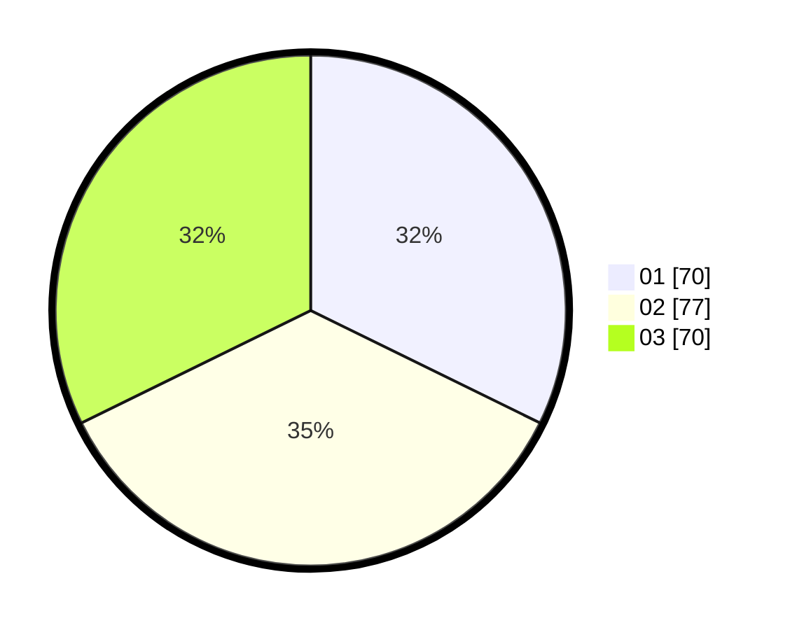

# Hasil

Hasil perolehan suara paslon dapat dilihat pada file paslon-01.txt, paslon-02.txt, dan paslon-03.txt.

Jika tidak ada, artinya data tersebut belum ada pada SIREKAP.

## Perolehan Suara

 * Paslon 01: **70**.
 * Paslon 02: **77**.
 * Paslon 03: **70**.

## Foto C Plano

https://sirekap-obj-formc.kpu.go.id/99bc/pemilu/ppwp/31/74/08/10/05/3174081005030-20240218-192914--36c808a7-faae-48a6-927e-8eba293c1969.jpg

https://sirekap-obj-formc.kpu.go.id/99bc/pemilu/ppwp/31/74/08/10/05/3174081005030-20240218-193645--7d9fc23b-c955-47d9-9994-2ff9dee69144.jpg

https://sirekap-obj-formc.kpu.go.id/99bc/pemilu/ppwp/31/74/08/10/05/3174081005030-20240218-193901--0fa6e85c-8730-4b01-82a5-5755c29d6514.jpg

## DATA PEMILIH TETAP

Jumlah pemilih dalam DPT: **262**.
 * L: **112**.
 * P: **150**.

## DATA PENGGUNA HAK PILIH

Jumlah pengguna hak pilih dalam DPT: **206**.
 * L: **93**.
 * P: **113**.

Jumlah pengguna hak pilih dalam DPTb: **10**.
 * L: **4**.
 * P: **6**.

Jumlah pengguna hak pilih dalam DPK: **2**.
 * L: **1**.
 * P: **1**.

Jumlah pengguna hak pilih: **218**.
 * L: **98**.
 * P: **120**.

## JUMLAH SUARA SAH DAN TIDAK SAH

JUMLAH SELURUH SUARA SAH: **217**.

JUMLAH SUARA TIDAK SAH: **1**.

JUMLAH SELURUH SUARA SAH DAN SUARA TIDAK SAH: **218**.
