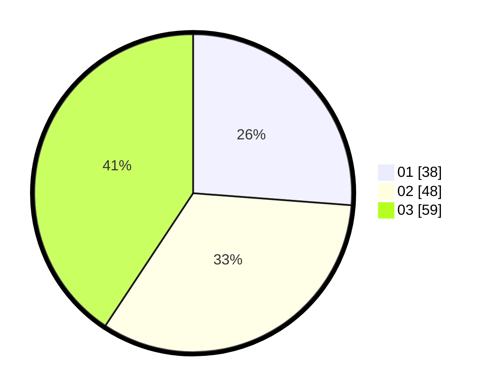

# Hasil

Hasil perolehan suara paslon dapat dilihat pada file paslon-01.txt, paslon-02.txt, dan paslon-03.txt.

Jika tidak ada, artinya data tersebut belum ada pada SIREKAP.

## Perolehan Suara

 * Paslon 01: **38**.
 * Paslon 02: **48**.
 * Paslon 03: **59**.

## Foto C Plano

https://sirekap-obj-formc.kpu.go.id/3e64/pemilu/ppwp/31/74/08/10/05/3174081005031-20240218-164130--66cea2eb-5306-457d-bf64-af186e3bdab3.jpg

https://sirekap-obj-formc.kpu.go.id/3e64/pemilu/ppwp/31/74/08/10/05/3174081005031-20240218-164828--e802cb8c-0d22-419a-98f6-c3917c8c86e5.jpg

https://sirekap-obj-formc.kpu.go.id/3e64/pemilu/ppwp/31/74/08/10/05/3174081005031-20240218-164959--185959fc-7e7a-4b14-9686-9807e3448498.jpg

## DATA PEMILIH TETAP

Jumlah pemilih dalam DPT: **197**.
 * L: **87**.
 * P: **110**.

## DATA PENGGUNA HAK PILIH

Jumlah pengguna hak pilih dalam DPT: **142**.
 * L: **58**.
 * P: **84**.

Jumlah pengguna hak pilih dalam DPTb: **3**.
 * L: **1**.
 * P: **2**.

Jumlah pengguna hak pilih dalam DPK: **3**.
 * L: **2**.
 * P: **1**.

Jumlah pengguna hak pilih: **148**.
 * L: **61**.
 * P: **87**.

## JUMLAH SUARA SAH DAN TIDAK SAH

JUMLAH SELURUH SUARA SAH: **145**.

JUMLAH SUARA TIDAK SAH: **3**.

JUMLAH SELURUH SUARA SAH DAN SUARA TIDAK SAH: **148**.
