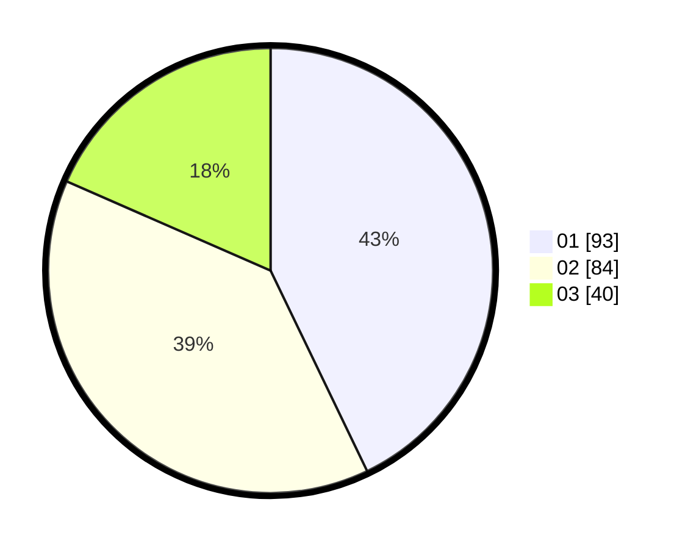

# Hasil

Hasil perolehan suara paslon dapat dilihat pada file paslon-01.txt, paslon-02.txt, dan paslon-03.txt.

Jika tidak ada, artinya data tersebut belum ada pada SIREKAP.

## Perolehan Suara

 * Paslon 01: **93**.
 * Paslon 02: **84**.
 * Paslon 03: **40**.

## Foto C Plano

https://sirekap-obj-formc.kpu.go.id/aa61/pemilu/ppwp/31/74/08/10/05/3174081005037-20240218-153313--aa8bab1d-a3ec-47e9-80d4-e4138a264404.jpg

https://sirekap-obj-formc.kpu.go.id/aa61/pemilu/ppwp/31/74/08/10/05/3174081005037-20240218-153531--bac56cc5-9403-4c56-b551-86b99b55fdf6.jpg

https://sirekap-obj-formc.kpu.go.id/aa61/pemilu/ppwp/31/74/08/10/05/3174081005037-20240218-153639--4314a2df-3737-4002-86f0-61e9312cc3e7.jpg

## DATA PEMILIH TETAP

Jumlah pemilih dalam DPT: **255**.
 * L: **124**.
 * P: **131**.

## DATA PENGGUNA HAK PILIH

Jumlah pengguna hak pilih dalam DPT: **210**.
 * L: **100**.
 * P: **110**.

Jumlah pengguna hak pilih dalam DPTb: **9**.
 * L: **3**.
 * P: **6**.

Jumlah pengguna hak pilih dalam DPK: **3**.
 * L: **1**.
 * P: **2**.

Jumlah pengguna hak pilih: **222**.
 * L: **104**.
 * P: **118**.

## JUMLAH SUARA SAH DAN TIDAK SAH

JUMLAH SELURUH SUARA SAH: **217**.

JUMLAH SUARA TIDAK SAH: **5**.

JUMLAH SELURUH SUARA SAH DAN SUARA TIDAK SAH: **222**.
