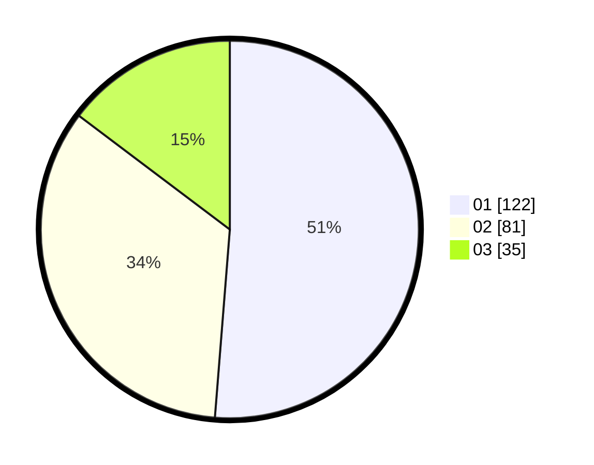

# Hasil

Hasil perolehan suara paslon dapat dilihat pada file paslon-01.txt, paslon-02.txt, dan paslon-03.txt.

Jika tidak ada, artinya data tersebut belum ada pada SIREKAP.

## Perolehan Suara

 * Paslon 01: **122**.
 * Paslon 02: **81**.
 * Paslon 03: **35**.

## Foto C Plano

https://sirekap-obj-formc.kpu.go.id/b44d/pemilu/ppwp/31/74/08/10/05/3174081005044-20240214-155138--a5967ff1-d80d-48dd-b0b0-c25a0aaa85f1.jpg

https://sirekap-obj-formc.kpu.go.id/b44d/pemilu/ppwp/31/74/08/10/05/3174081005044-20240214-155144--b01ccbbf-2592-432b-affe-5f9399fd0f52.jpg

https://sirekap-obj-formc.kpu.go.id/b44d/pemilu/ppwp/31/74/08/10/05/3174081005044-20240214-155127--a76df3ea-bde6-4dd2-98a9-26a3dff61496.jpg

## DATA PEMILIH TETAP

Jumlah pemilih dalam DPT: **291**.
 * L: **152**.
 * P: **139**.

## DATA PENGGUNA HAK PILIH

Jumlah pengguna hak pilih dalam DPT: **230**.
 * L: **118**.
 * P: **112**.

Jumlah pengguna hak pilih dalam DPTb: **15**.
 * L: **6**.
 * P: **9**.

Jumlah pengguna hak pilih dalam DPK: **0**.
 * L: **0**.
 * P: **0**.

Jumlah pengguna hak pilih: **245**.
 * L: **124**.
 * P: **121**.

## JUMLAH SUARA SAH DAN TIDAK SAH

JUMLAH SELURUH SUARA SAH: **238**.

JUMLAH SUARA TIDAK SAH: **7**.

JUMLAH SELURUH SUARA SAH DAN SUARA TIDAK SAH: **245**.
