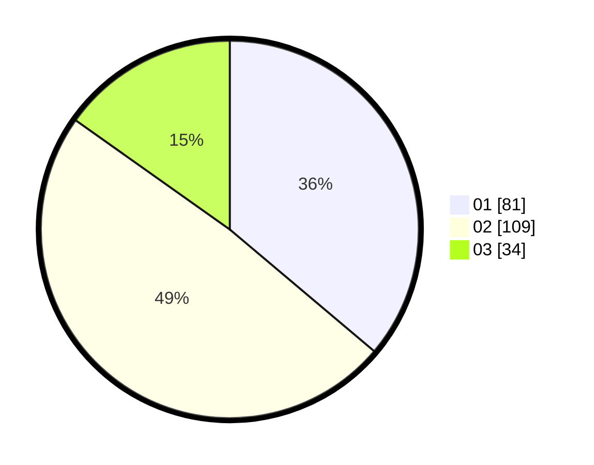

# Hasil

Hasil perolehan suara paslon dapat dilihat pada file paslon-01.txt, paslon-02.txt, dan paslon-03.txt.

Jika tidak ada, artinya data tersebut belum ada pada SIREKAP.

## Perolehan Suara

 * Paslon 01: **81**.
 * Paslon 02: **109**.
 * Paslon 03: **34**.

## Foto C Plano

https://sirekap-obj-formc.kpu.go.id/e76a/pemilu/ppwp/31/74/08/10/05/3174081005053-20240215-053039--59982b87-adb4-4402-a5c7-fecccecc1d91.jpg

https://sirekap-obj-formc.kpu.go.id/e76a/pemilu/ppwp/31/74/08/10/05/3174081005053-20240215-053103--19ef521f-889a-4a67-9a77-3a71e4b2b1e0.jpg

https://sirekap-obj-formc.kpu.go.id/e76a/pemilu/ppwp/31/74/08/10/05/3174081005053-20240215-053050--f9359775-8714-4bbf-aae9-bfac8f783e5c.jpg

## DATA PEMILIH TETAP

Jumlah pemilih dalam DPT: **279**.
 * L: **137**.
 * P: **142**.

## DATA PENGGUNA HAK PILIH

Jumlah pengguna hak pilih dalam DPT: **221**.
 * L: **103**.
 * P: **118**.

Jumlah pengguna hak pilih dalam DPTb: **4**.
 * L: **1**.
 * P: **3**.

Jumlah pengguna hak pilih dalam DPK: **3**.
 * L: **1**.
 * P: **2**.

Jumlah pengguna hak pilih: **228**.
 * L: **105**.
 * P: **123**.

## JUMLAH SUARA SAH DAN TIDAK SAH

JUMLAH SELURUH SUARA SAH: **224**.

JUMLAH SUARA TIDAK SAH: **4**.

JUMLAH SELURUH SUARA SAH DAN SUARA TIDAK SAH: **228**.
