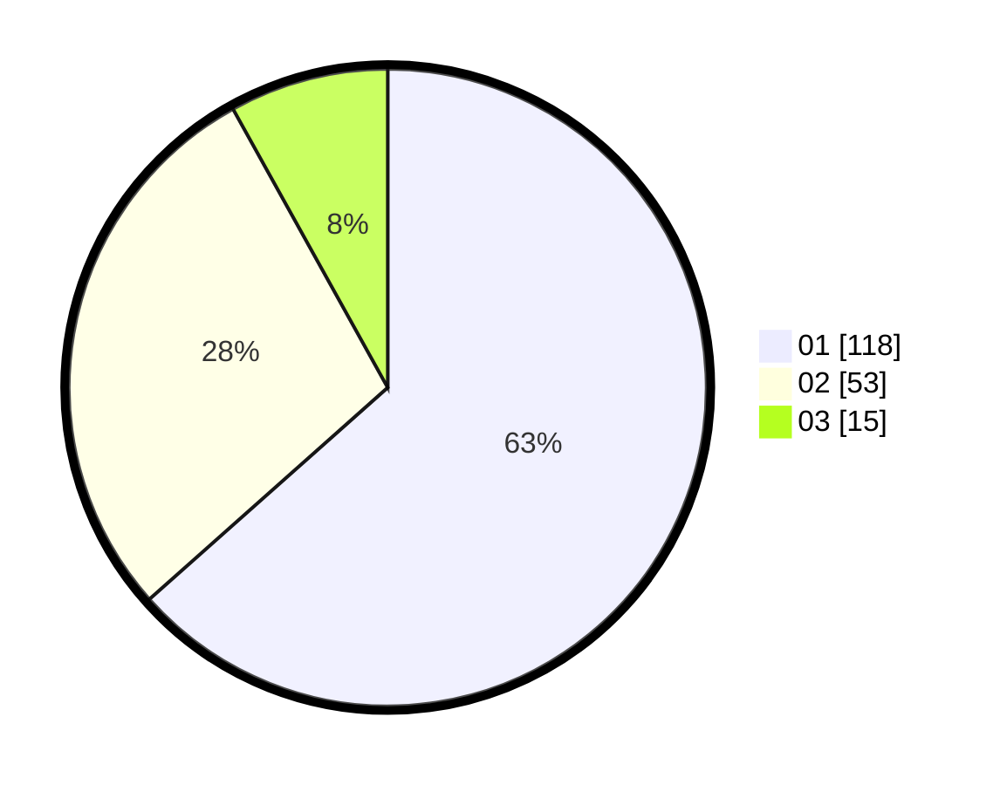

# Hasil

Hasil perolehan suara paslon dapat dilihat pada file paslon-01.txt, paslon-02.txt, dan paslon-03.txt.

Jika tidak ada, artinya data tersebut belum ada pada SIREKAP.

## Perolehan Suara

 * Paslon 01: **118**.
 * Paslon 02: **53**.
 * Paslon 03: **15**.

## Foto C Plano

https://sirekap-obj-formc.kpu.go.id/4838/pemilu/ppwp/31/74/08/10/05/3174081005054-20240215-031754--0d2702af-a765-4251-9832-07064bdba4b6.jpg

https://sirekap-obj-formc.kpu.go.id/4838/pemilu/ppwp/31/74/08/10/05/3174081005054-20240215-031810--858fd3ff-f815-4aa4-b6c9-f1bac6fa0e60.jpg

https://sirekap-obj-formc.kpu.go.id/4838/pemilu/ppwp/31/74/08/10/05/3174081005054-20240215-031820--4fe673d8-3614-434c-bb77-1f7c09638e3f.jpg

## DATA PEMILIH TETAP

Jumlah pemilih dalam DPT: **227**.
 * L: **110**.
 * P: **117**.

## DATA PENGGUNA HAK PILIH

Jumlah pengguna hak pilih dalam DPT: **179**.
 * L: **88**.
 * P: **91**.

Jumlah pengguna hak pilih dalam DPTb: **5**.
 * L: **3**.
 * P: **2**.

Jumlah pengguna hak pilih dalam DPK: **3**.
 * L: **1**.
 * P: **2**.

Jumlah pengguna hak pilih: **187**.
 * L: **92**.
 * P: **95**.

## JUMLAH SUARA SAH DAN TIDAK SAH

JUMLAH SELURUH SUARA SAH: **186**.

JUMLAH SUARA TIDAK SAH: **1**.

JUMLAH SELURUH SUARA SAH DAN SUARA TIDAK SAH: **187**.
