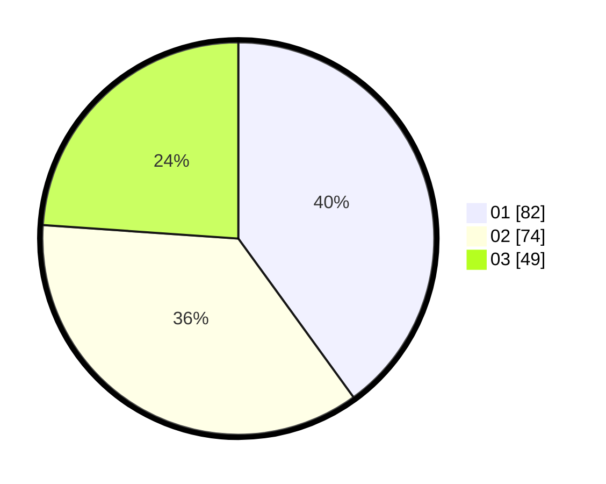

# Hasil

Hasil perolehan suara paslon dapat dilihat pada file paslon-01.txt, paslon-02.txt, dan paslon-03.txt.

Jika tidak ada, artinya data tersebut belum ada pada SIREKAP.

## Perolehan Suara

 * Paslon 01: **82**.
 * Paslon 02: **74**.
 * Paslon 03: **49**.

## Foto C Plano

https://sirekap-obj-formc.kpu.go.id/8514/pemilu/ppwp/31/74/08/10/05/3174081005055-20240219-133837--d2417f4d-9653-40d9-be59-2a934072c13e.jpg

https://sirekap-obj-formc.kpu.go.id/8514/pemilu/ppwp/31/74/08/10/05/3174081005055-20240219-145120--84d3c843-737d-4361-a5cc-16402035b2ea.jpg

https://sirekap-obj-formc.kpu.go.id/8514/pemilu/ppwp/31/74/08/10/05/3174081005055-20240219-145205--95aff5a4-4a8a-456e-a9b2-b996edbde182.jpg

## DATA PEMILIH TETAP

Jumlah pemilih dalam DPT: **257**.
 * L: **126**.
 * P: **131**.

## DATA PENGGUNA HAK PILIH

Jumlah pengguna hak pilih dalam DPT: **194**.
 * L: **87**.
 * P: **107**.

Jumlah pengguna hak pilih dalam DPTb: **14**.
 * L: **9**.
 * P: **5**.

Jumlah pengguna hak pilih dalam DPK: **0**.
 * L: **0**.
 * P: **0**.

Jumlah pengguna hak pilih: **208**.
 * L: **96**.
 * P: **112**.

## JUMLAH SUARA SAH DAN TIDAK SAH

JUMLAH SELURUH SUARA SAH: **205**.

JUMLAH SUARA TIDAK SAH: **3**.

JUMLAH SELURUH SUARA SAH DAN SUARA TIDAK SAH: **208**.
