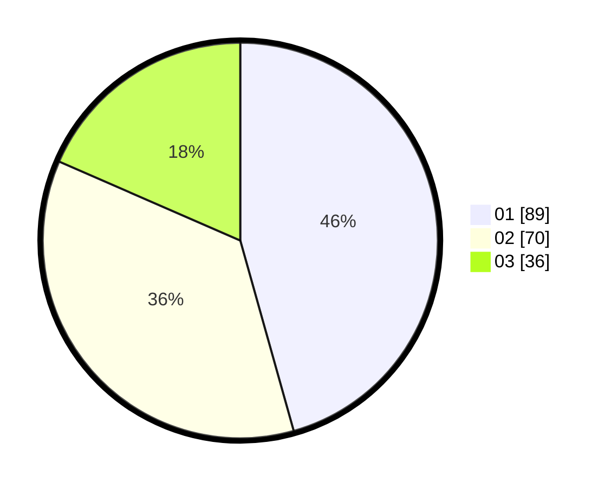

# Hasil

Hasil perolehan suara paslon dapat dilihat pada file paslon-01.txt, paslon-02.txt, dan paslon-03.txt.

Jika tidak ada, artinya data tersebut belum ada pada SIREKAP.

## Perolehan Suara

 * Paslon 01: **89**.
 * Paslon 02: **70**.
 * Paslon 03: **36**.

## Foto C Plano

https://sirekap-obj-formc.kpu.go.id/007f/pemilu/ppwp/31/74/08/10/05/3174081005059-20240218-152042--b28ddf06-d9a9-4612-8252-1bfdb0feca03.jpg

https://sirekap-obj-formc.kpu.go.id/007f/pemilu/ppwp/31/74/08/10/05/3174081005059-20240218-152233--d382d94e-6315-4888-8d69-a85684cf3ec0.jpg

https://sirekap-obj-formc.kpu.go.id/007f/pemilu/ppwp/31/74/08/10/05/3174081005059-20240218-152758--b53824a9-41a4-4040-87fb-3bdc369acc34.jpg

## DATA PEMILIH TETAP

Jumlah pemilih dalam DPT: **275**.
 * L: **142**.
 * P: **133**.

## DATA PENGGUNA HAK PILIH

Jumlah pengguna hak pilih dalam DPT: **198**.
 * L: **95**.
 * P: **103**.

Jumlah pengguna hak pilih dalam DPTb: **0**.
 * L: **0**.
 * P: **0**.

Jumlah pengguna hak pilih dalam DPK: **0**.
 * L: **0**.
 * P: **0**.

Jumlah pengguna hak pilih: **198**.
 * L: **95**.
 * P: **103**.

## JUMLAH SUARA SAH DAN TIDAK SAH

JUMLAH SELURUH SUARA SAH: **195**.

JUMLAH SUARA TIDAK SAH: **4**.

JUMLAH SELURUH SUARA SAH DAN SUARA TIDAK SAH: **199**.
