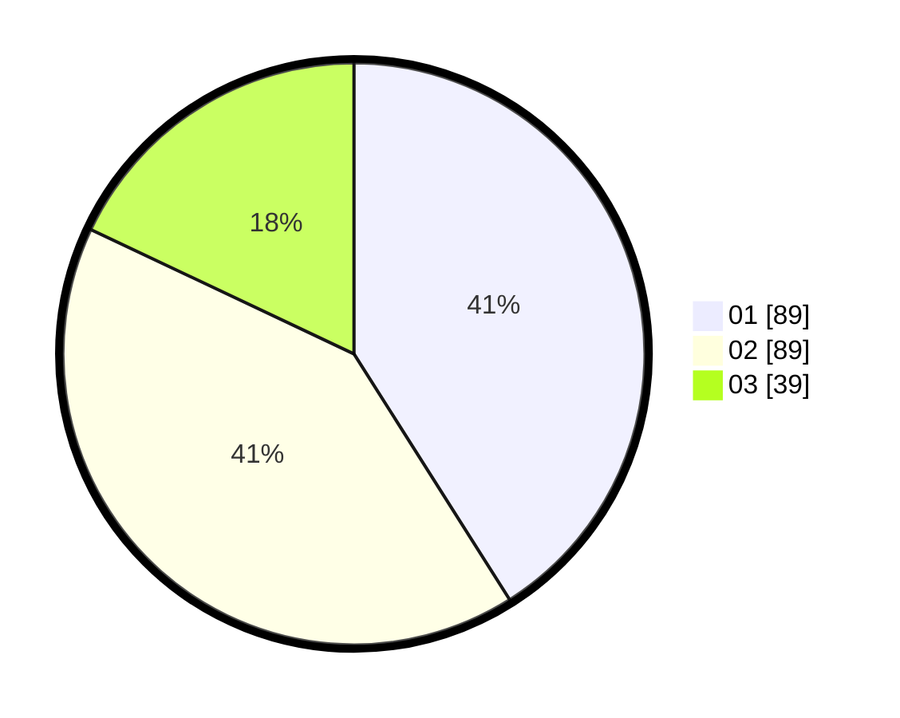

# Hasil

Hasil perolehan suara paslon dapat dilihat pada file paslon-01.txt, paslon-02.txt, dan paslon-03.txt.

Jika tidak ada, artinya data tersebut belum ada pada SIREKAP.

## Perolehan Suara

 * Paslon 01: **89**.
 * Paslon 02: **89**.
 * Paslon 03: **39**.

## Foto C Plano

https://sirekap-obj-formc.kpu.go.id/7618/pemilu/ppwp/31/74/08/10/05/3174081005065-20240216-140855--935bddf3-3044-4a9e-8c83-71b9a32f8723.jpg

https://sirekap-obj-formc.kpu.go.id/7618/pemilu/ppwp/31/74/08/10/05/3174081005065-20240216-141344--33ea7e22-8b6a-4810-8b59-af92c69026cf.jpg

https://sirekap-obj-formc.kpu.go.id/7618/pemilu/ppwp/31/74/08/10/05/3174081005065-20240216-141756--5249a677-f8ff-4aac-bad2-97c05e13150c.jpg

## DATA PEMILIH TETAP

Jumlah pemilih dalam DPT: **257**.
 * L: **122**.
 * P: **135**.

## DATA PENGGUNA HAK PILIH

Jumlah pengguna hak pilih dalam DPT: **205**.
 * L: **95**.
 * P: **110**.

Jumlah pengguna hak pilih dalam DPTb: **4**.
 * L: **2**.
 * P: **2**.

Jumlah pengguna hak pilih dalam DPK: **8**.
 * L: **2**.
 * P: **6**.

Jumlah pengguna hak pilih: **217**.
 * L: **99**.
 * P: **118**.

## JUMLAH SUARA SAH DAN TIDAK SAH

JUMLAH SELURUH SUARA SAH: **217**.

JUMLAH SUARA TIDAK SAH: **0**.

JUMLAH SELURUH SUARA SAH DAN SUARA TIDAK SAH: **217**.
