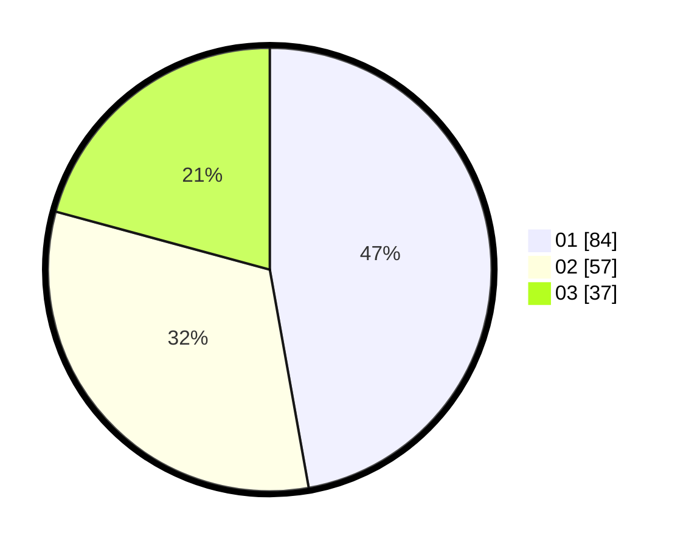

# Hasil

Hasil perolehan suara paslon dapat dilihat pada file paslon-01.txt, paslon-02.txt, dan paslon-03.txt.

Jika tidak ada, artinya data tersebut belum ada pada SIREKAP.

## Perolehan Suara

 * Paslon 01: **84**.
 * Paslon 02: **57**.
 * Paslon 03: **37**.

## Foto C Plano

https://sirekap-obj-formc.kpu.go.id/9ae6/pemilu/ppwp/31/74/08/10/05/3174081005066-20240219-201404--bc94a387-8f81-4115-8959-daa1d59d79c8.jpg

https://sirekap-obj-formc.kpu.go.id/9ae6/pemilu/ppwp/31/74/08/10/05/3174081005066-20240219-201529--a742566a-99d2-4567-8466-0efa98b91b07.jpg

https://sirekap-obj-formc.kpu.go.id/9ae6/pemilu/ppwp/31/74/08/10/05/3174081005066-20240219-213206--83c339ce-7e5f-453d-9620-236ee59f6f08.jpg

## DATA PEMILIH TETAP

Jumlah pemilih dalam DPT: **205**.
 * L: **104**.
 * P: **101**.

## DATA PENGGUNA HAK PILIH

Jumlah pengguna hak pilih dalam DPT: **180**.
 * L: **88**.
 * P: **92**.

Jumlah pengguna hak pilih dalam DPTb: **5**.
 * L: **2**.
 * P: **3**.

Jumlah pengguna hak pilih dalam DPK: **3**.
 * L: **2**.
 * P: **1**.

Jumlah pengguna hak pilih: **188**.
 * L: **92**.
 * P: **96**.

## JUMLAH SUARA SAH DAN TIDAK SAH

JUMLAH SELURUH SUARA SAH: **185**.

JUMLAH SUARA TIDAK SAH: **3**.

JUMLAH SELURUH SUARA SAH DAN SUARA TIDAK SAH: **188**.
