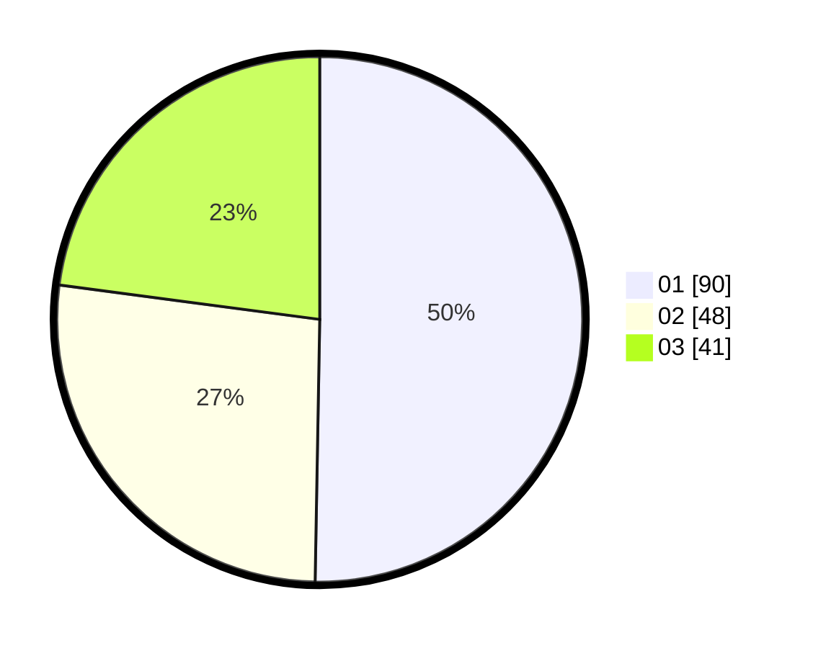

# Hasil

Hasil perolehan suara paslon dapat dilihat pada file paslon-01.txt, paslon-02.txt, dan paslon-03.txt.

Jika tidak ada, artinya data tersebut belum ada pada SIREKAP.

## Perolehan Suara

 * Paslon 01: **90**.
 * Paslon 02: **48**.
 * Paslon 03: **41**.

## Foto C Plano

https://sirekap-obj-formc.kpu.go.id/3ede/pemilu/ppwp/31/74/08/10/06/3174081006001-20240217-153827--a70fe1a3-7efe-429d-9b9c-12ca314c963b.jpg

https://sirekap-obj-formc.kpu.go.id/3ede/pemilu/ppwp/31/74/08/10/06/3174081006001-20240217-154357--2a9d24ad-7961-41ab-92f1-9e7922936cb6.jpg

https://sirekap-obj-formc.kpu.go.id/3ede/pemilu/ppwp/31/74/08/10/06/3174081006001-20240217-153203--f9756440-4531-4e1b-a746-e6d835298870.jpg

## DATA PEMILIH TETAP

Jumlah pemilih dalam DPT: **255**.
 * L: **128**.
 * P: **127**.

## DATA PENGGUNA HAK PILIH

Jumlah pengguna hak pilih dalam DPT: **178**.
 * L: **90**.
 * P: **88**.

Jumlah pengguna hak pilih dalam DPTb: **5**.
 * L: **4**.
 * P: **1**.

Jumlah pengguna hak pilih dalam DPK: **2**.
 * L: **1**.
 * P: **1**.

Jumlah pengguna hak pilih: **185**.
 * L: **95**.
 * P: **90**.

## JUMLAH SUARA SAH DAN TIDAK SAH

JUMLAH SELURUH SUARA SAH: **179**.

JUMLAH SUARA TIDAK SAH: **6**.

JUMLAH SELURUH SUARA SAH DAN SUARA TIDAK SAH: **185**.
