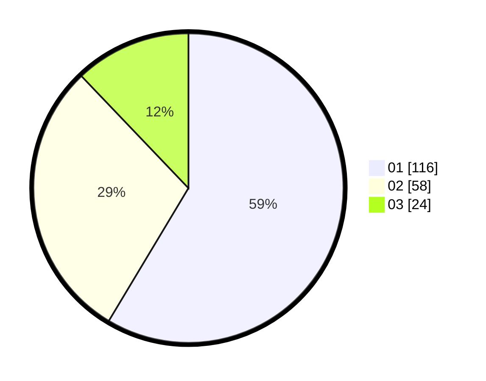

# Hasil

Hasil perolehan suara paslon dapat dilihat pada file paslon-01.txt, paslon-02.txt, dan paslon-03.txt.

Jika tidak ada, artinya data tersebut belum ada pada SIREKAP.

## Perolehan Suara

 * Paslon 01: **116**.
 * Paslon 02: **58**.
 * Paslon 03: **24**.

## Foto C Plano

https://sirekap-obj-formc.kpu.go.id/71ac/pemilu/ppwp/31/74/08/10/06/3174081006002-20240217-211817--2716d95f-a02c-436d-b081-b9b850b243a2.jpg

https://sirekap-obj-formc.kpu.go.id/71ac/pemilu/ppwp/31/74/08/10/06/3174081006002-20240217-212102--b44e5305-e01a-4281-becc-3839c7457ba9.jpg

https://sirekap-obj-formc.kpu.go.id/71ac/pemilu/ppwp/31/74/08/10/06/3174081006002-20240217-212212--b44ba415-0c28-4c51-9593-d6418b6300b6.jpg

## DATA PEMILIH TETAP

Jumlah pemilih dalam DPT: **280**.
 * L: **149**.
 * P: **131**.

## DATA PENGGUNA HAK PILIH

Jumlah pengguna hak pilih dalam DPT: **196**.
 * L: **99**.
 * P: **97**.

Jumlah pengguna hak pilih dalam DPTb: **5**.
 * L: **4**.
 * P: **1**.

Jumlah pengguna hak pilih dalam DPK: **0**.
 * L: **0**.
 * P: **0**.

Jumlah pengguna hak pilih: **201**.
 * L: **103**.
 * P: **98**.

## JUMLAH SUARA SAH DAN TIDAK SAH

JUMLAH SELURUH SUARA SAH: **198**.

JUMLAH SUARA TIDAK SAH: **3**.

JUMLAH SELURUH SUARA SAH DAN SUARA TIDAK SAH: **201**.
