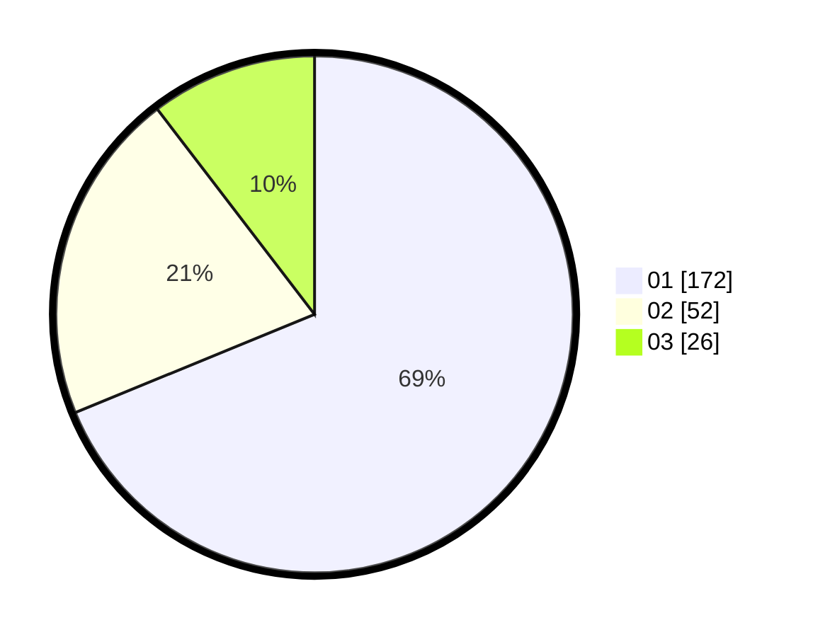

# Hasil

Hasil perolehan suara paslon dapat dilihat pada file paslon-01.txt, paslon-02.txt, dan paslon-03.txt.

Jika tidak ada, artinya data tersebut belum ada pada SIREKAP.

## Perolehan Suara

 * Paslon 01: **172**.
 * Paslon 02: **52**.
 * Paslon 03: **26**.

## Foto C Plano

https://sirekap-obj-formc.kpu.go.id/903d/pemilu/ppwp/31/74/08/10/06/3174081006005-20240218-124135--05fcfbef-ced4-4f21-a300-6dd20de82d77.jpg

https://sirekap-obj-formc.kpu.go.id/903d/pemilu/ppwp/31/74/08/10/06/3174081006005-20240218-124137--754bd622-17e2-4205-9360-9954676fe107.jpg

https://sirekap-obj-formc.kpu.go.id/903d/pemilu/ppwp/31/74/08/10/06/3174081006005-20240218-124136--4ec487f9-1ccb-4af7-96c3-85912510760b.jpg

## DATA PEMILIH TETAP

Jumlah pemilih dalam DPT: **0**.
 * L: **0**.
 * P: **0**.

## DATA PENGGUNA HAK PILIH

Jumlah pengguna hak pilih dalam DPT: **0**.
 * L: **0**.
 * P: **0**.

Jumlah pengguna hak pilih dalam DPTb: **0**.
 * L: **0**.
 * P: **0**.

Jumlah pengguna hak pilih dalam DPK: **0**.
 * L: **0**.
 * P: **0**.

Jumlah pengguna hak pilih: **0**.
 * L: **0**.
 * P: **0**.

## JUMLAH SUARA SAH DAN TIDAK SAH

JUMLAH SELURUH SUARA SAH: **250**.

JUMLAH SUARA TIDAK SAH: **2**.

JUMLAH SELURUH SUARA SAH DAN SUARA TIDAK SAH: **252**.
