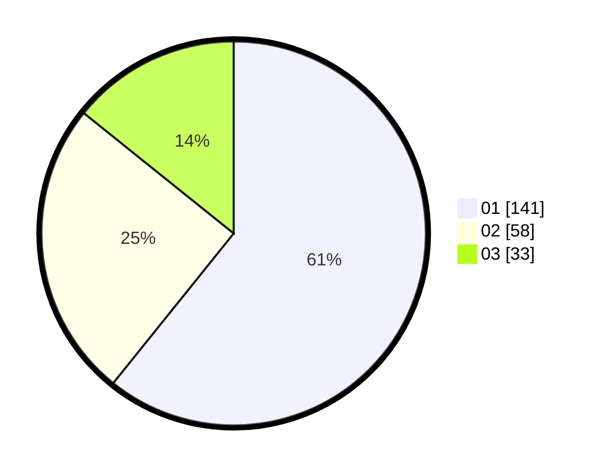

# Hasil

Hasil perolehan suara paslon dapat dilihat pada file paslon-01.txt, paslon-02.txt, dan paslon-03.txt.

Jika tidak ada, artinya data tersebut belum ada pada SIREKAP.

## Perolehan Suara

 * Paslon 01: **141**.
 * Paslon 02: **58**.
 * Paslon 03: **33**.

## Foto C Plano

https://sirekap-obj-formc.kpu.go.id/c646/pemilu/ppwp/31/74/08/10/06/3174081006008-20240214-200300--c68e62eb-6d7b-4fac-9cad-f6e671caf9ea.jpg

https://sirekap-obj-formc.kpu.go.id/c646/pemilu/ppwp/31/74/08/10/06/3174081006008-20240214-200324--89ad6ff6-6c88-46f6-b14f-8e51f135d75c.jpg

https://sirekap-obj-formc.kpu.go.id/c646/pemilu/ppwp/31/74/08/10/06/3174081006008-20240214-200338--f30488db-19f2-4505-815d-ceb150f4f5bd.jpg

## DATA PEMILIH TETAP

Jumlah pemilih dalam DPT: **282**.
 * L: **145**.
 * P: **137**.

## DATA PENGGUNA HAK PILIH

Jumlah pengguna hak pilih dalam DPT: **217**.
 * L: **111**.
 * P: **106**.

Jumlah pengguna hak pilih dalam DPTb: **16**.
 * L: **10**.
 * P: **6**.

Jumlah pengguna hak pilih dalam DPK: **6**.
 * L: **2**.
 * P: **4**.

Jumlah pengguna hak pilih: **239**.
 * L: **123**.
 * P: **116**.

## JUMLAH SUARA SAH DAN TIDAK SAH

JUMLAH SELURUH SUARA SAH: **232**.

JUMLAH SUARA TIDAK SAH: **7**.

JUMLAH SELURUH SUARA SAH DAN SUARA TIDAK SAH: **239**.
