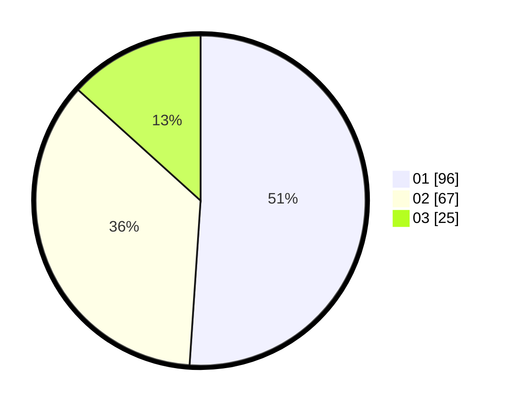

# Hasil

Hasil perolehan suara paslon dapat dilihat pada file paslon-01.txt, paslon-02.txt, dan paslon-03.txt.

Jika tidak ada, artinya data tersebut belum ada pada SIREKAP.

## Perolehan Suara

 * Paslon 01: **96**.
 * Paslon 02: **67**.
 * Paslon 03: **25**.

## Foto C Plano

https://sirekap-obj-formc.kpu.go.id/13e7/pemilu/ppwp/31/74/08/10/06/3174081006012-20240215-224143--c51c4720-02e3-477f-b215-6adf1e62c2ca.jpg

https://sirekap-obj-formc.kpu.go.id/13e7/pemilu/ppwp/31/74/08/10/06/3174081006012-20240215-224147--f6dd97c5-0406-452b-a696-4be76dd49376.jpg

https://sirekap-obj-formc.kpu.go.id/13e7/pemilu/ppwp/31/74/08/10/06/3174081006012-20240215-224146--45909bdf-d438-4416-9771-4bb2c82b0646.jpg

## DATA PEMILIH TETAP

Jumlah pemilih dalam DPT: **240**.
 * L: **121**.
 * P: **119**.

## DATA PENGGUNA HAK PILIH

Jumlah pengguna hak pilih dalam DPT: **186**.
 * L: **92**.
 * P: **94**.

Jumlah pengguna hak pilih dalam DPTb: **6**.
 * L: **3**.
 * P: **3**.

Jumlah pengguna hak pilih dalam DPK: **1**.
 * L: **0**.
 * P: **1**.

Jumlah pengguna hak pilih: **193**.
 * L: **95**.
 * P: **98**.

## JUMLAH SUARA SAH DAN TIDAK SAH

JUMLAH SELURUH SUARA SAH: **188**.

JUMLAH SUARA TIDAK SAH: **5**.

JUMLAH SELURUH SUARA SAH DAN SUARA TIDAK SAH: **193**.
