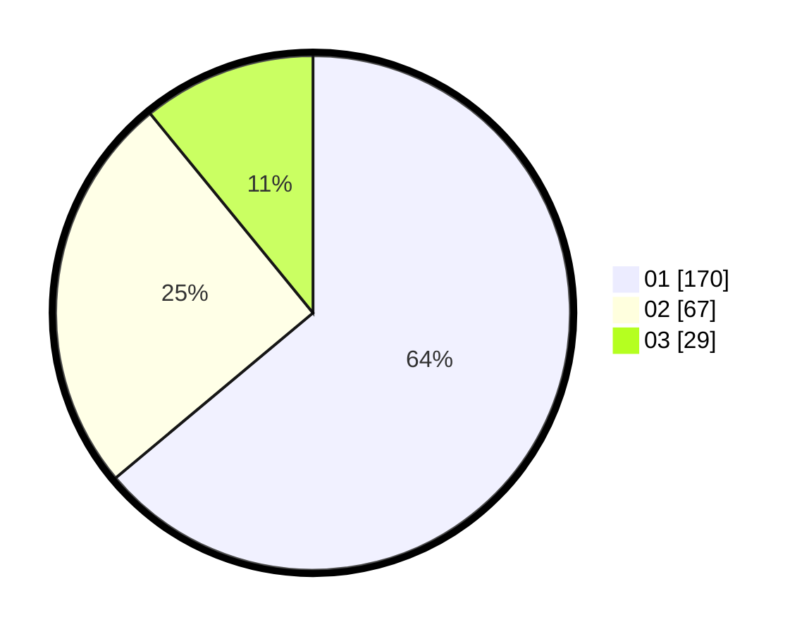

# Hasil

Hasil perolehan suara paslon dapat dilihat pada file paslon-01.txt, paslon-02.txt, dan paslon-03.txt.

Jika tidak ada, artinya data tersebut belum ada pada SIREKAP.

## Perolehan Suara

 * Paslon 01: **170**.
 * Paslon 02: **67**.
 * Paslon 03: **29**.

## Foto C Plano

https://sirekap-obj-formc.kpu.go.id/a9b0/pemilu/ppwp/31/74/08/10/06/3174081006031-20240217-010422--3afcfe23-04c0-41c8-bf5c-e0dbdcfb7b19.jpg

https://sirekap-obj-formc.kpu.go.id/a9b0/pemilu/ppwp/31/74/08/10/06/3174081006031-20240215-204613--4cfe406a-ff13-4ee7-a8a3-b1008104b731.jpg

https://sirekap-obj-formc.kpu.go.id/a9b0/pemilu/ppwp/31/74/08/10/06/3174081006031-20240215-224950--bf22ac1f-7759-4f19-b7e4-a6efa3abf69f.jpg

## DATA PEMILIH TETAP

Jumlah pemilih dalam DPT: **284**.
 * L: **142**.
 * P: **142**.

## DATA PENGGUNA HAK PILIH

Jumlah pengguna hak pilih dalam DPT: **249**.
 * L: **121**.
 * P: **128**.

Jumlah pengguna hak pilih dalam DPTb: **18**.
 * L: **4**.
 * P: **14**.

Jumlah pengguna hak pilih dalam DPK: **1**.
 * L: **0**.
 * P: **1**.

Jumlah pengguna hak pilih: **268**.
 * L: **125**.
 * P: **143**.

## JUMLAH SUARA SAH DAN TIDAK SAH

JUMLAH SELURUH SUARA SAH: **266**.

JUMLAH SUARA TIDAK SAH: **2**.

JUMLAH SELURUH SUARA SAH DAN SUARA TIDAK SAH: **268**.
