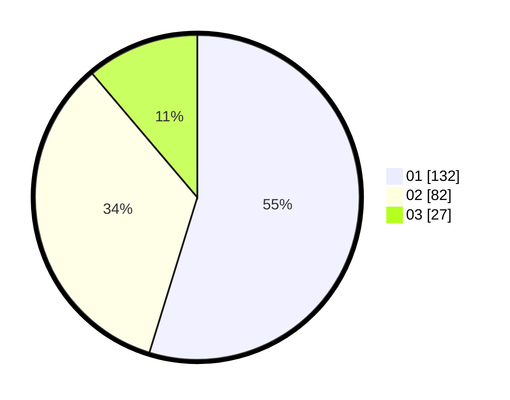

# Hasil

Hasil perolehan suara paslon dapat dilihat pada file paslon-01.txt, paslon-02.txt, dan paslon-03.txt.

Jika tidak ada, artinya data tersebut belum ada pada SIREKAP.

## Perolehan Suara

 * Paslon 01: **132**.
 * Paslon 02: **82**.
 * Paslon 03: **27**.

## Foto C Plano

https://sirekap-obj-formc.kpu.go.id/b6af/pemilu/ppwp/31/74/08/10/06/3174081006034-20240214-155655--6f2f76f0-18ca-46e7-953c-cb3549ff2c8b.jpg

https://sirekap-obj-formc.kpu.go.id/b6af/pemilu/ppwp/31/74/08/10/06/3174081006034-20240214-160118--ebb713be-4397-45bd-907e-331bafe40a5e.jpg

https://sirekap-obj-formc.kpu.go.id/b6af/pemilu/ppwp/31/74/08/10/06/3174081006034-20240214-234602--c4c77e1b-7a26-4f7f-a83d-a9cbd00174e0.jpg

## DATA PEMILIH TETAP

Jumlah pemilih dalam DPT: **273**.
 * L: **129**.
 * P: **144**.

## DATA PENGGUNA HAK PILIH

Jumlah pengguna hak pilih dalam DPT: **219**.
 * L: **102**.
 * P: **117**.

Jumlah pengguna hak pilih dalam DPTb: **22**.
 * L: **15**.
 * P: **7**.

Jumlah pengguna hak pilih dalam DPK: **1**.
 * L: **0**.
 * P: **1**.

Jumlah pengguna hak pilih: **242**.
 * L: **117**.
 * P: **125**.

## JUMLAH SUARA SAH DAN TIDAK SAH

JUMLAH SELURUH SUARA SAH: **241**.

JUMLAH SUARA TIDAK SAH: **2**.

JUMLAH SELURUH SUARA SAH DAN SUARA TIDAK SAH: **242**.
