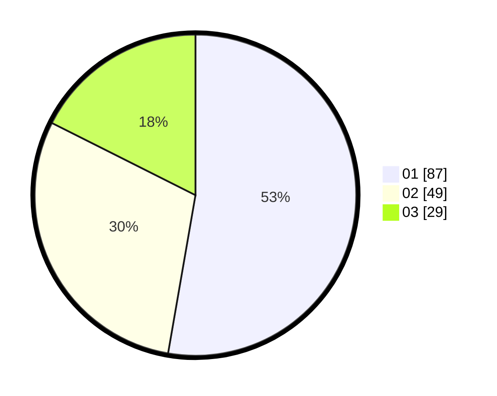

# Hasil

Hasil perolehan suara paslon dapat dilihat pada file paslon-01.txt, paslon-02.txt, dan paslon-03.txt.

Jika tidak ada, artinya data tersebut belum ada pada SIREKAP.

## Perolehan Suara

 * Paslon 01: **87**.
 * Paslon 02: **49**.
 * Paslon 03: **29**.

## Foto C Plano

https://sirekap-obj-formc.kpu.go.id/8c7a/pemilu/ppwp/31/74/08/10/06/3174081006036-20240214-185821--7bc0cfbd-e994-4691-afe2-0a386af98d07.jpg

https://sirekap-obj-formc.kpu.go.id/8c7a/pemilu/ppwp/31/74/08/10/06/3174081006036-20240214-185806--3a93d893-4aa6-478e-8bc0-60b7a222d840.jpg

https://sirekap-obj-formc.kpu.go.id/8c7a/pemilu/ppwp/31/74/08/10/06/3174081006036-20240214-183706--4d3872cb-716d-4bbd-b7f2-b028f8b36671.jpg

## DATA PEMILIH TETAP

Jumlah pemilih dalam DPT: **213**.
 * L: **105**.
 * P: **108**.

## DATA PENGGUNA HAK PILIH

Jumlah pengguna hak pilih dalam DPT: **154**.
 * L: **74**.
 * P: **80**.

Jumlah pengguna hak pilih dalam DPTb: **11**.
 * L: **8**.
 * P: **3**.

Jumlah pengguna hak pilih dalam DPK: **1**.
 * L: **1**.
 * P: **0**.

Jumlah pengguna hak pilih: **166**.
 * L: **83**.
 * P: **83**.

## JUMLAH SUARA SAH DAN TIDAK SAH

JUMLAH SELURUH SUARA SAH: **165**.

JUMLAH SUARA TIDAK SAH: **1**.

JUMLAH SELURUH SUARA SAH DAN SUARA TIDAK SAH: **166**.
