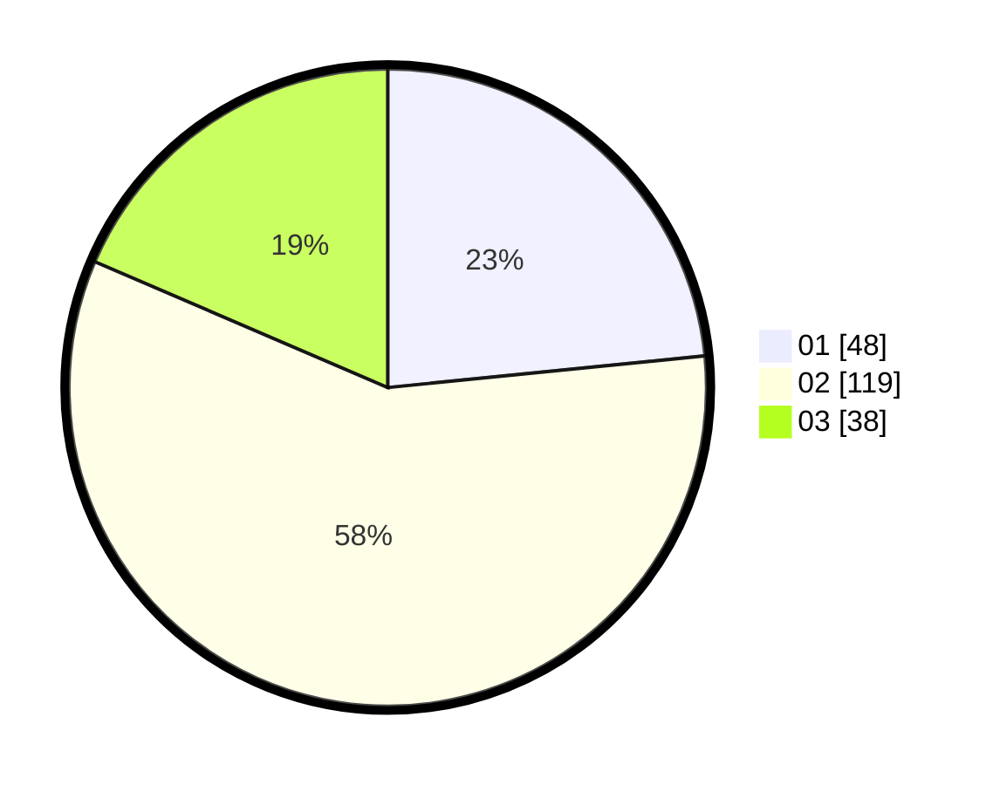

# Hasil

Hasil perolehan suara paslon dapat dilihat pada file paslon-01.txt, paslon-02.txt, dan paslon-03.txt.

Jika tidak ada, artinya data tersebut belum ada pada SIREKAP.

## Perolehan Suara

 * Paslon 01: **48**.
 * Paslon 02: **119**.
 * Paslon 03: **38**.

## Foto C Plano

https://sirekap-obj-formc.kpu.go.id/ade6/pemilu/ppwp/31/74/09/10/01/3174091001001-20240215-000709--545199e7-f996-47cc-9fac-70e730537be7.jpg

https://sirekap-obj-formc.kpu.go.id/ade6/pemilu/ppwp/31/74/09/10/01/3174091001001-20240215-000815--c63e26f6-2f1e-4ac9-aa38-b05fb195c548.jpg

https://sirekap-obj-formc.kpu.go.id/ade6/pemilu/ppwp/31/74/09/10/01/3174091001001-20240215-000934--ece7dbf7-bf49-4923-aafc-ea377929eadd.jpg
