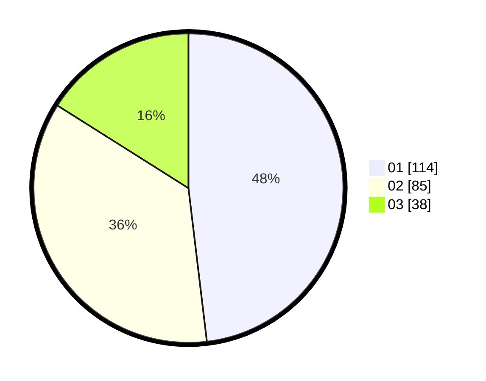

# Hasil

Hasil perolehan suara paslon dapat dilihat pada file paslon-01.txt, paslon-02.txt, dan paslon-03.txt.

Jika tidak ada, artinya data tersebut belum ada pada SIREKAP.

## Perolehan Suara

 * Paslon 01: **114**.
 * Paslon 02: **85**.
 * Paslon 03: **38**.

## Foto C Plano

https://sirekap-obj-formc.kpu.go.id/ed8c/pemilu/ppwp/31/74/09/10/01/3174091001012-20240214-213927--1f61190c-65ea-4b95-b00f-c1fcfcbe6efd.jpg

https://sirekap-obj-formc.kpu.go.id/ed8c/pemilu/ppwp/31/74/09/10/01/3174091001012-20240214-214111--48b84341-69e0-4172-89ed-ac5c7e9eb03f.jpg

https://sirekap-obj-formc.kpu.go.id/ed8c/pemilu/ppwp/31/74/09/10/01/3174091001012-20240214-214139--133128d5-46ea-4ac5-88a5-9b9e7bf0b580.jpg
