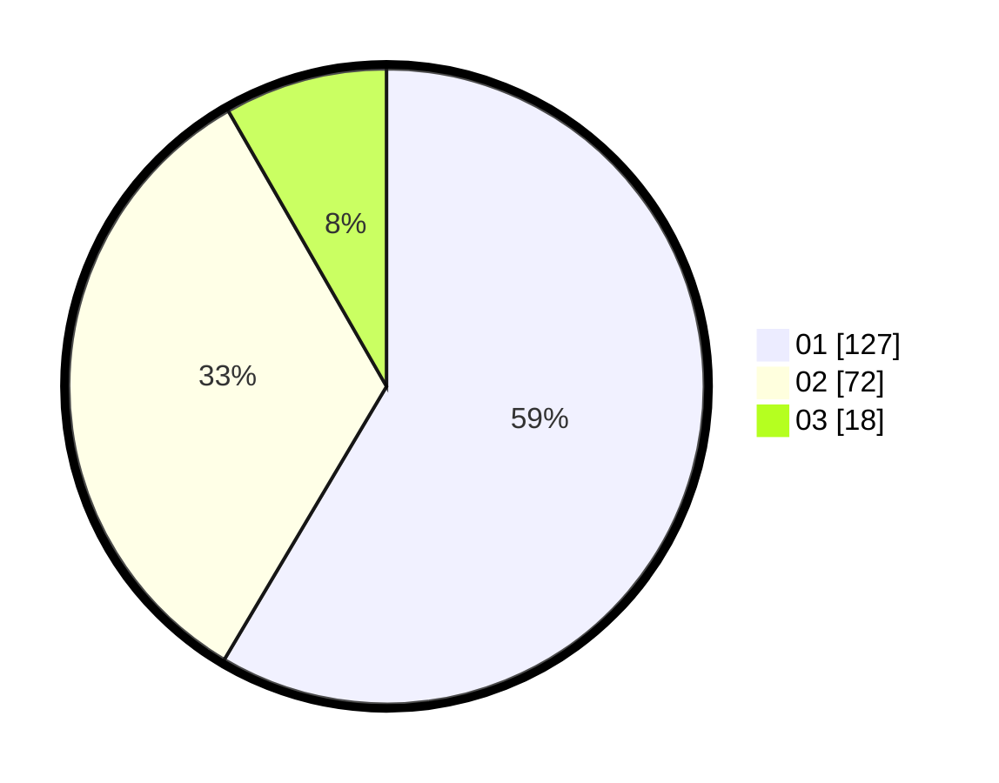

# Hasil

Hasil perolehan suara paslon dapat dilihat pada file paslon-01.txt, paslon-02.txt, dan paslon-03.txt.

Jika tidak ada, artinya data tersebut belum ada pada SIREKAP.

## Perolehan Suara

 * Paslon 01: **127**.
 * Paslon 02: **72**.
 * Paslon 03: **18**.

## Foto C Plano

https://sirekap-obj-formc.kpu.go.id/2959/pemilu/ppwp/31/74/09/10/01/3174091001016-20240214-155221--1270e2d8-7dce-4fa5-aec4-858a74a0bf0f.jpg

https://sirekap-obj-formc.kpu.go.id/2959/pemilu/ppwp/31/74/09/10/01/3174091001016-20240214-155823--4b15bb37-5f62-48ee-9b48-27b944c2f8af.jpg

https://sirekap-obj-formc.kpu.go.id/2959/pemilu/ppwp/31/74/09/10/01/3174091001016-20240214-192418--320826bc-f6cd-4f90-ba02-93f146d54192.jpg

## DATA PEMILIH TETAP

Jumlah pemilih dalam DPT: **264**.
 * L: **137**.
 * P: **127**.

## DATA PENGGUNA HAK PILIH

Jumlah pengguna hak pilih dalam DPT: **213**.
 * L: **103**.
 * P: **110**.

Jumlah pengguna hak pilih dalam DPTb: **1**.
 * L: **1**.
 * P: **0**.

Jumlah pengguna hak pilih dalam DPK: **5**.
 * L: **2**.
 * P: **3**.

Jumlah pengguna hak pilih: **219**.
 * L: **106**.
 * P: **113**.

## JUMLAH SUARA SAH DAN TIDAK SAH

JUMLAH SELURUH SUARA SAH: **217**.

JUMLAH SUARA TIDAK SAH: **2**.

JUMLAH SELURUH SUARA SAH DAN SUARA TIDAK SAH: **219**.
