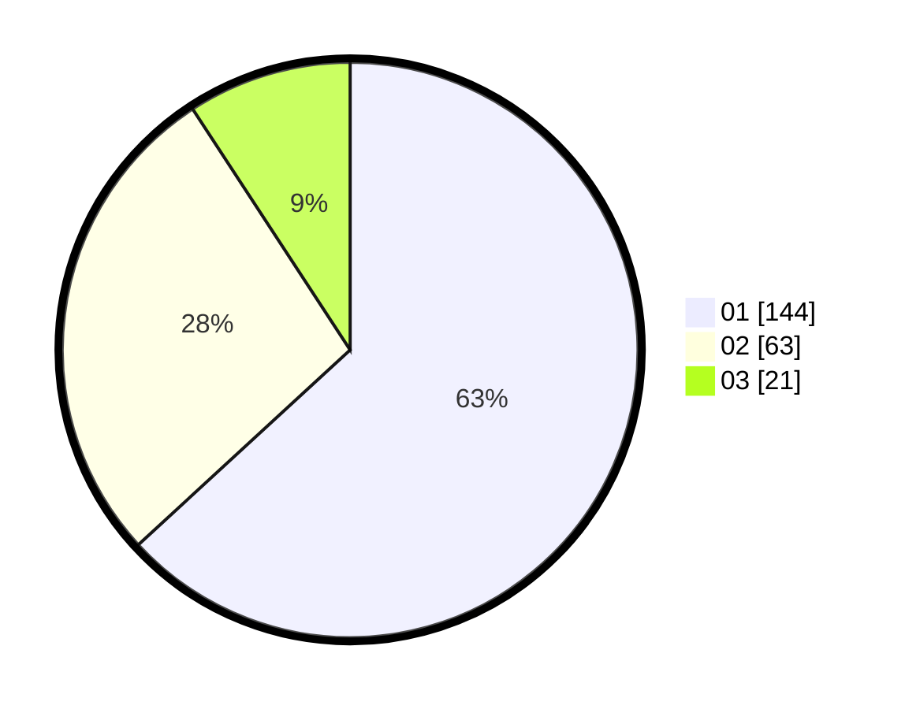

# Hasil

Hasil perolehan suara paslon dapat dilihat pada file paslon-01.txt, paslon-02.txt, dan paslon-03.txt.

Jika tidak ada, artinya data tersebut belum ada pada SIREKAP.

## Perolehan Suara

 * Paslon 01: **144**.
 * Paslon 02: **63**.
 * Paslon 03: **21**.

## Foto C Plano

https://sirekap-obj-formc.kpu.go.id/0304/pemilu/ppwp/31/74/09/10/01/3174091001017-20240214-191627--26b74685-a284-40a0-8882-aac217430c71.jpg

https://sirekap-obj-formc.kpu.go.id/0304/pemilu/ppwp/31/74/09/10/01/3174091001017-20240214-155626--467659be-cfd1-41c1-b0ba-a94deb6a7ae3.jpg

https://sirekap-obj-formc.kpu.go.id/0304/pemilu/ppwp/31/74/09/10/01/3174091001017-20240214-160133--31e440d9-eb65-423a-a6dd-c1a96d224fde.jpg
