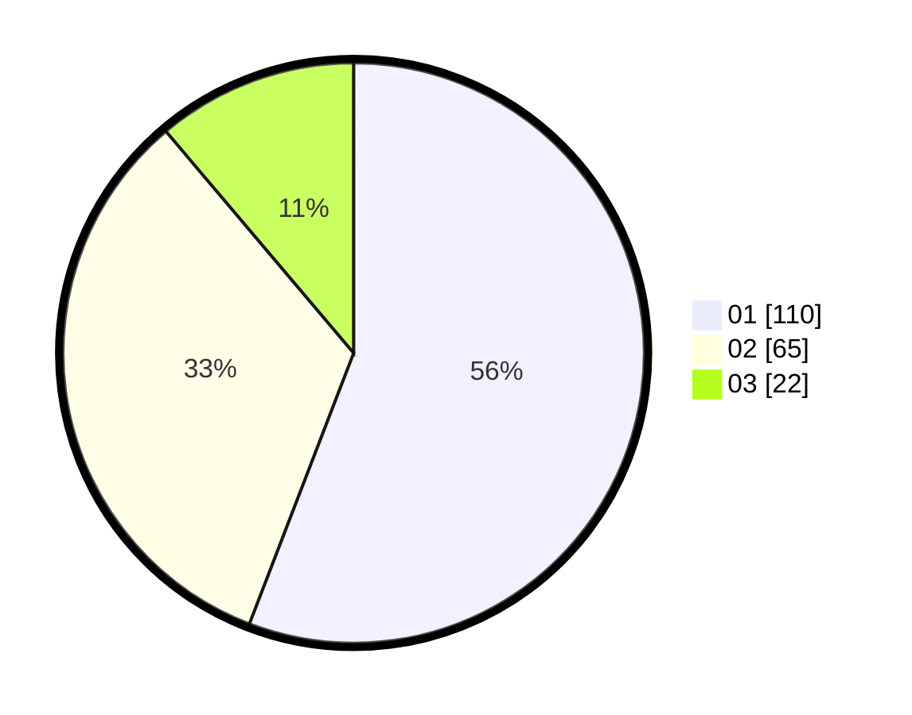

# Hasil

Hasil perolehan suara paslon dapat dilihat pada file paslon-01.txt, paslon-02.txt, dan paslon-03.txt.

Jika tidak ada, artinya data tersebut belum ada pada SIREKAP.

## Perolehan Suara

 * Paslon 01: **110**.
 * Paslon 02: **65**.
 * Paslon 03: **22**.

## Foto C Plano

https://sirekap-obj-formc.kpu.go.id/903c/pemilu/ppwp/31/74/09/10/01/3174091001025-20240216-141811--3798d3ad-e9b5-4686-9cfd-80493af52a05.jpg

https://sirekap-obj-formc.kpu.go.id/903c/pemilu/ppwp/31/74/09/10/01/3174091001025-20240216-141813--451ac08d-9ba8-4e40-ad79-497c14106b3d.jpg

https://sirekap-obj-formc.kpu.go.id/903c/pemilu/ppwp/31/74/09/10/01/3174091001025-20240216-141812--9c7dd91f-472a-4b2b-afd9-b91ac34995ad.jpg

## DATA PEMILIH TETAP

Jumlah pemilih dalam DPT: **257**.
 * L: **125**.
 * P: **132**.

## DATA PENGGUNA HAK PILIH

Jumlah pengguna hak pilih dalam DPT: **200**.
 * L: **98**.
 * P: **102**.

Jumlah pengguna hak pilih dalam DPTb: **0**.
 * L: **0**.
 * P: **0**.

Jumlah pengguna hak pilih dalam DPK: **2**.
 * L: **2**.
 * P: **0**.

Jumlah pengguna hak pilih: **202**.
 * L: **100**.
 * P: **102**.

## JUMLAH SUARA SAH DAN TIDAK SAH

JUMLAH SELURUH SUARA SAH: **197**.

JUMLAH SUARA TIDAK SAH: **5**.

JUMLAH SELURUH SUARA SAH DAN SUARA TIDAK SAH: **202**.
