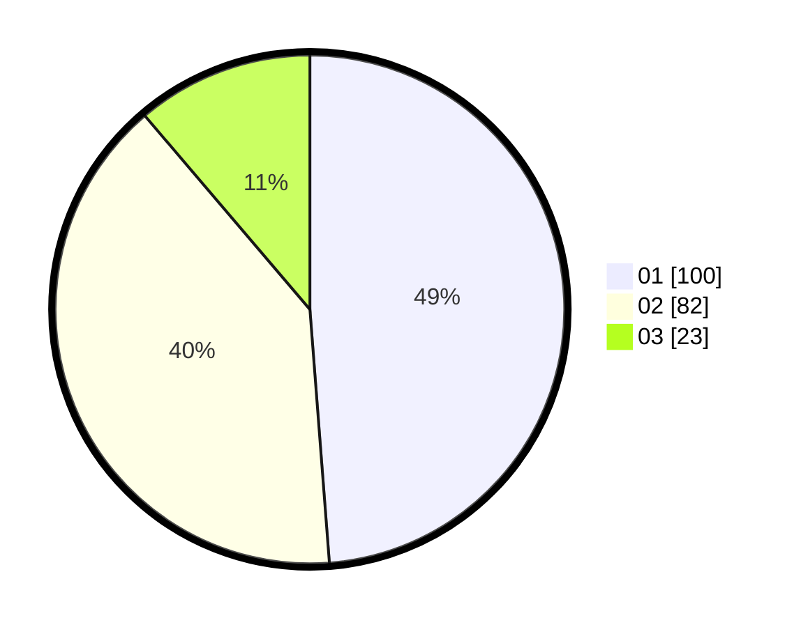

# Hasil

Hasil perolehan suara paslon dapat dilihat pada file paslon-01.txt, paslon-02.txt, dan paslon-03.txt.

Jika tidak ada, artinya data tersebut belum ada pada SIREKAP.

## Perolehan Suara

 * Paslon 01: **100**.
 * Paslon 02: **82**.
 * Paslon 03: **23**.

## Foto C Plano

https://sirekap-obj-formc.kpu.go.id/065d/pemilu/ppwp/31/74/09/10/01/3174091001032-20240214-185814--301c107b-87e6-446c-8675-36bc256d8ba9.jpg

https://sirekap-obj-formc.kpu.go.id/065d/pemilu/ppwp/31/74/09/10/01/3174091001032-20240214-185824--65a0a81f-fd17-4d4d-8524-093a9de6b7a0.jpg

https://sirekap-obj-formc.kpu.go.id/065d/pemilu/ppwp/31/74/09/10/01/3174091001032-20240214-191237--c9db240f-94ba-4f1a-858c-20109b241091.jpg

## DATA PEMILIH TETAP

Jumlah pemilih dalam DPT: **253**.
 * L: **125**.
 * P: **128**.

## DATA PENGGUNA HAK PILIH

Jumlah pengguna hak pilih dalam DPT: **193**.
 * L: **90**.
 * P: **103**.

Jumlah pengguna hak pilih dalam DPTb: **16**.
 * L: **7**.
 * P: **9**.

Jumlah pengguna hak pilih dalam DPK: **1**.
 * L: **0**.
 * P: **1**.

Jumlah pengguna hak pilih: **210**.
 * L: **97**.
 * P: **113**.

## JUMLAH SUARA SAH DAN TIDAK SAH

JUMLAH SELURUH SUARA SAH: **205**.

JUMLAH SUARA TIDAK SAH: **5**.

JUMLAH SELURUH SUARA SAH DAN SUARA TIDAK SAH: **210**.
