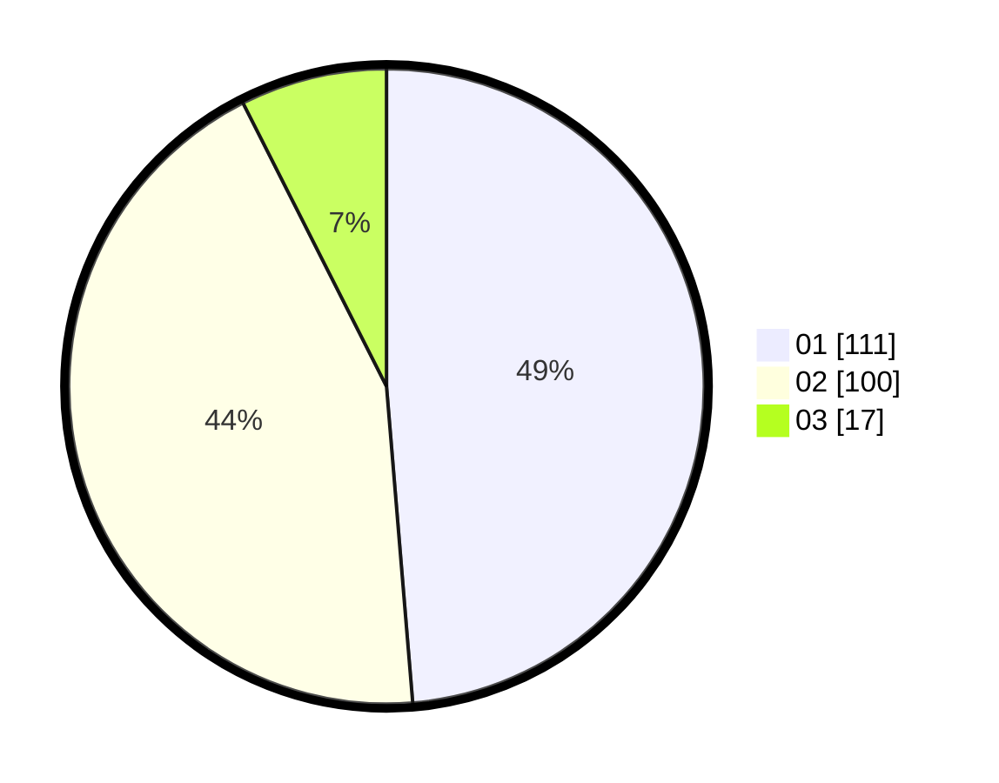

# Hasil

Hasil perolehan suara paslon dapat dilihat pada file paslon-01.txt, paslon-02.txt, dan paslon-03.txt.

Jika tidak ada, artinya data tersebut belum ada pada SIREKAP.

## Perolehan Suara

 * Paslon 01: **111**.
 * Paslon 02: **100**.
 * Paslon 03: **17**.

## Foto C Plano

https://sirekap-obj-formc.kpu.go.id/b27e/pemilu/ppwp/31/74/09/10/01/3174091001066-20240217-234214--4722ebfa-b505-4180-a5fb-34fecfc6210d.jpg

https://sirekap-obj-formc.kpu.go.id/b27e/pemilu/ppwp/31/74/09/10/01/3174091001066-20240217-234215--207fe36e-a4a3-4a7b-8b24-b2eee1efa232.jpg

https://sirekap-obj-formc.kpu.go.id/b27e/pemilu/ppwp/31/74/09/10/01/3174091001066-20240217-234215--71bdc194-4ea0-40ee-a174-3a8b6706cdaa.jpg

## DATA PEMILIH TETAP

Jumlah pemilih dalam DPT: **0**.
 * L: **0**.
 * P: **0**.

## DATA PENGGUNA HAK PILIH

Jumlah pengguna hak pilih dalam DPT: **0**.
 * L: **0**.
 * P: **0**.

Jumlah pengguna hak pilih dalam DPTb: **0**.
 * L: **0**.
 * P: **0**.

Jumlah pengguna hak pilih dalam DPK: **0**.
 * L: **0**.
 * P: **0**.

Jumlah pengguna hak pilih: **0**.
 * L: **0**.
 * P: **0**.

## JUMLAH SUARA SAH DAN TIDAK SAH

JUMLAH SELURUH SUARA SAH: **228**.

JUMLAH SUARA TIDAK SAH: **0**.

JUMLAH SELURUH SUARA SAH DAN SUARA TIDAK SAH: **228**.
