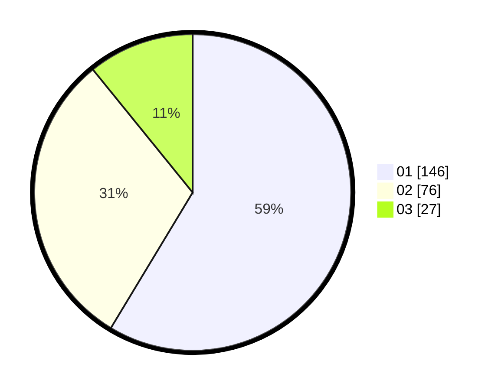

# Hasil

Hasil perolehan suara paslon dapat dilihat pada file paslon-01.txt, paslon-02.txt, dan paslon-03.txt.

Jika tidak ada, artinya data tersebut belum ada pada SIREKAP.

## Perolehan Suara

 * Paslon 01: **146**.
 * Paslon 02: **76**.
 * Paslon 03: **27**.

## Foto C Plano

https://sirekap-obj-formc.kpu.go.id/310e/pemilu/ppwp/31/74/09/10/01/3174091001078-20240216-133934--3c5b08f8-c517-4e3b-b586-1c354b8cae67.jpg

https://sirekap-obj-formc.kpu.go.id/310e/pemilu/ppwp/31/74/09/10/01/3174091001078-20240216-134650--fe7a7f73-a9b7-4646-93ef-58fb2c8cc6bb.jpg

https://sirekap-obj-formc.kpu.go.id/310e/pemilu/ppwp/31/74/09/10/01/3174091001078-20240216-135603--0666b801-7378-4681-b75a-cf9597369a80.jpg

## DATA PEMILIH TETAP

Jumlah pemilih dalam DPT: **288**.
 * L: **129**.
 * P: **159**.

## DATA PENGGUNA HAK PILIH

Jumlah pengguna hak pilih dalam DPT: **246**.
 * L: **110**.
 * P: **136**.

Jumlah pengguna hak pilih dalam DPTb: **1**.
 * L: **1**.
 * P: **0**.

Jumlah pengguna hak pilih dalam DPK: **4**.
 * L: **1**.
 * P: **3**.

Jumlah pengguna hak pilih: **251**.
 * L: **112**.
 * P: **139**.

## JUMLAH SUARA SAH DAN TIDAK SAH

JUMLAH SELURUH SUARA SAH: **249**.

JUMLAH SUARA TIDAK SAH: **2**.

JUMLAH SELURUH SUARA SAH DAN SUARA TIDAK SAH: **251**.
