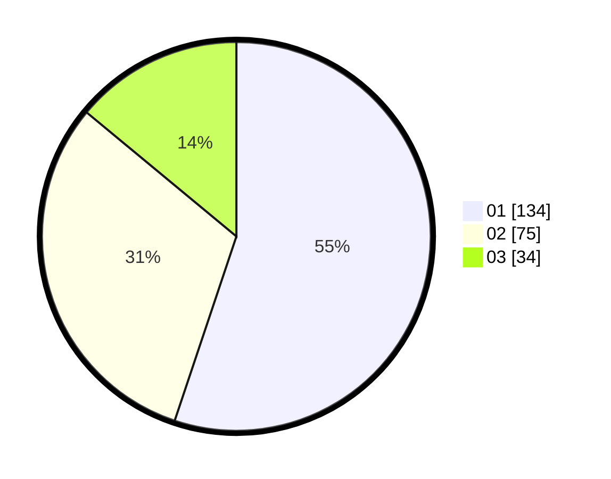

# Hasil

Hasil perolehan suara paslon dapat dilihat pada file paslon-01.txt, paslon-02.txt, dan paslon-03.txt.

Jika tidak ada, artinya data tersebut belum ada pada SIREKAP.

## Perolehan Suara

 * Paslon 01: **134**.
 * Paslon 02: **75**.
 * Paslon 03: **34**.

## Foto C Plano

https://sirekap-obj-formc.kpu.go.id/840f/pemilu/ppwp/31/74/09/10/01/3174091001079-20240214-155151--183eaa2d-832f-4fac-9257-53bf64961097.jpg

https://sirekap-obj-formc.kpu.go.id/840f/pemilu/ppwp/31/74/09/10/01/3174091001079-20240214-155219--eeaeb38b-5fee-44b4-a607-f631f3f8d1cd.jpg

https://sirekap-obj-formc.kpu.go.id/840f/pemilu/ppwp/31/74/09/10/01/3174091001079-20240214-155239--d79e0355-f31d-46a1-bced-e75b37a39e1c.jpg

## DATA PEMILIH TETAP

Jumlah pemilih dalam DPT: **291**.
 * L: **136**.
 * P: **155**.

## DATA PENGGUNA HAK PILIH

Jumlah pengguna hak pilih dalam DPT: **249**.
 * L: **110**.
 * P: **139**.

Jumlah pengguna hak pilih dalam DPTb: **0**.
 * L: **0**.
 * P: **0**.

Jumlah pengguna hak pilih dalam DPK: **0**.
 * L: **0**.
 * P: **0**.

Jumlah pengguna hak pilih: **249**.
 * L: **110**.
 * P: **139**.

## JUMLAH SUARA SAH DAN TIDAK SAH

JUMLAH SELURUH SUARA SAH: **243**.

JUMLAH SUARA TIDAK SAH: **6**.

JUMLAH SELURUH SUARA SAH DAN SUARA TIDAK SAH: **249**.
