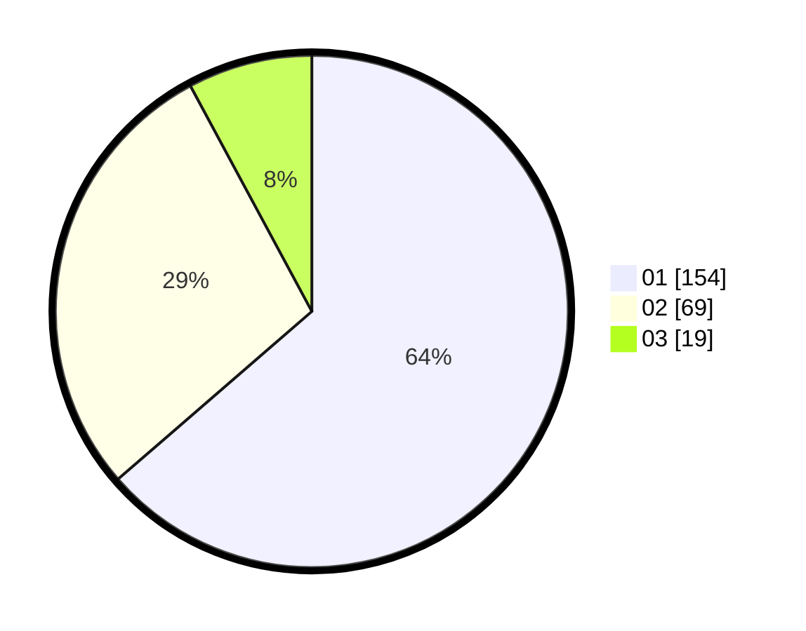

# Hasil

Hasil perolehan suara paslon dapat dilihat pada file paslon-01.txt, paslon-02.txt, dan paslon-03.txt.

Jika tidak ada, artinya data tersebut belum ada pada SIREKAP.

## Perolehan Suara

 * Paslon 01: **154**.
 * Paslon 02: **69**.
 * Paslon 03: **19**.

## Foto C Plano

https://sirekap-obj-formc.kpu.go.id/d62b/pemilu/ppwp/31/74/09/10/01/3174091001080-20240214-155752--c409c307-19de-4cbb-9626-d31547c92a9b.jpg

https://sirekap-obj-formc.kpu.go.id/d62b/pemilu/ppwp/31/74/09/10/01/3174091001080-20240214-155120--f752335c-ba0f-4d8b-a5bf-cf530be567c2.jpg

https://sirekap-obj-formc.kpu.go.id/d62b/pemilu/ppwp/31/74/09/10/01/3174091001080-20240214-155216--37b89f53-d064-4c24-8de3-32259f4337cf.jpg
