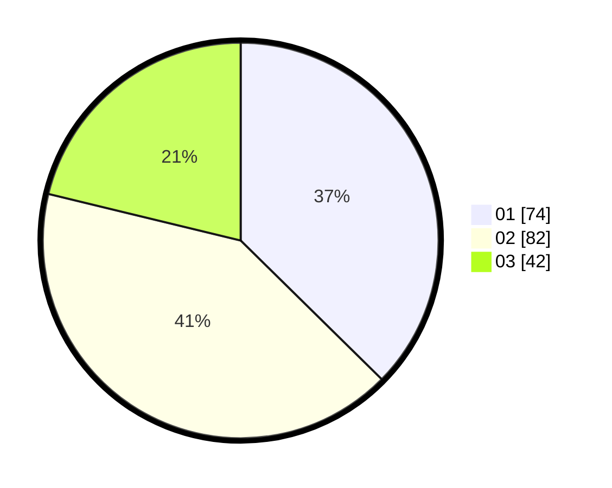

# Hasil

Hasil perolehan suara paslon dapat dilihat pada file paslon-01.txt, paslon-02.txt, dan paslon-03.txt.

Jika tidak ada, artinya data tersebut belum ada pada SIREKAP.

## Perolehan Suara

 * Paslon 01: **74**.
 * Paslon 02: **82**.
 * Paslon 03: **42**.

## Foto C Plano

https://sirekap-obj-formc.kpu.go.id/27d0/pemilu/ppwp/31/74/09/10/01/3174091001081-20240214-155224--fcfa6645-7e33-4801-8edf-1ecc8ed58ef7.jpg

https://sirekap-obj-formc.kpu.go.id/27d0/pemilu/ppwp/31/74/09/10/01/3174091001081-20240214-155516--45395be3-f257-45dc-80e1-e335002fe0dd.jpg

https://sirekap-obj-formc.kpu.go.id/27d0/pemilu/ppwp/31/74/09/10/01/3174091001081-20240214-155707--c333966b-5d7f-4999-ac39-e0dc6ac50adc.jpg

## DATA PEMILIH TETAP

Jumlah pemilih dalam DPT: **258**.
 * L: **127**.
 * P: **131**.

## DATA PENGGUNA HAK PILIH

Jumlah pengguna hak pilih dalam DPT: **201**.
 * L: **93**.
 * P: **108**.

Jumlah pengguna hak pilih dalam DPTb: **0**.
 * L: **0**.
 * P: **0**.

Jumlah pengguna hak pilih dalam DPK: **0**.
 * L: **0**.
 * P: **0**.

Jumlah pengguna hak pilih: **201**.
 * L: **93**.
 * P: **108**.

## JUMLAH SUARA SAH DAN TIDAK SAH

JUMLAH SELURUH SUARA SAH: **198**.

JUMLAH SUARA TIDAK SAH: **3**.

JUMLAH SELURUH SUARA SAH DAN SUARA TIDAK SAH: **201**.
