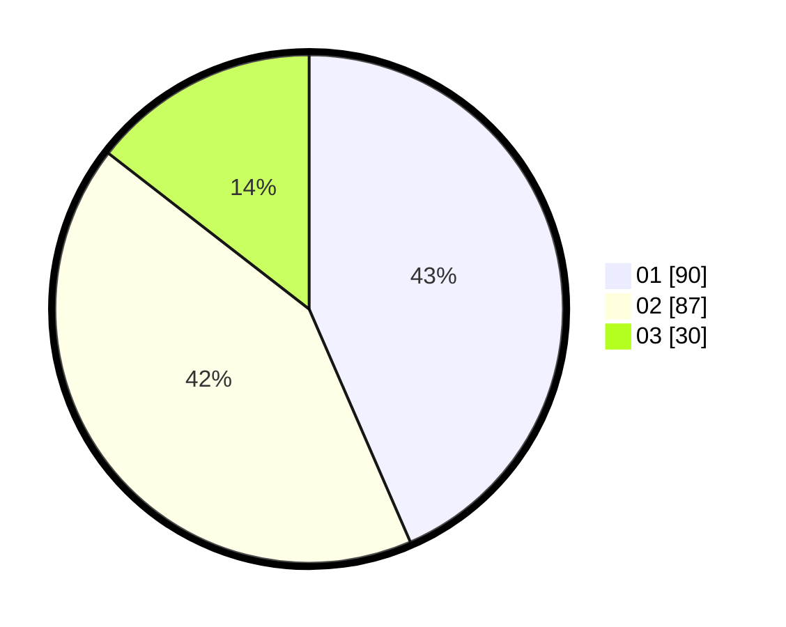

# Hasil

Hasil perolehan suara paslon dapat dilihat pada file paslon-01.txt, paslon-02.txt, dan paslon-03.txt.

Jika tidak ada, artinya data tersebut belum ada pada SIREKAP.

## Perolehan Suara

 * Paslon 01: **90**.
 * Paslon 02: **87**.
 * Paslon 03: **30**.

## Foto C Plano

https://sirekap-obj-formc.kpu.go.id/1f29/pemilu/ppwp/31/74/09/10/01/3174091001084-20240216-154829--853ce601-6fa8-4759-ab54-ee050ae3efce.jpg

https://sirekap-obj-formc.kpu.go.id/1f29/pemilu/ppwp/31/74/09/10/01/3174091001084-20240214-191030--b7aee22d-86c7-4354-968f-f94544d2d515.jpg

https://sirekap-obj-formc.kpu.go.id/1f29/pemilu/ppwp/31/74/09/10/01/3174091001084-20240214-192554--6cb674e4-4d75-4c1f-bc92-b2dbe98bc19b.jpg

## DATA PEMILIH TETAP

Jumlah pemilih dalam DPT: **270**.
 * L: **125**.
 * P: **145**.

## DATA PENGGUNA HAK PILIH

Jumlah pengguna hak pilih dalam DPT: **270**.
 * L: **125**.
 * P: **145**.

Jumlah pengguna hak pilih dalam DPTb: **1**.
 * L: **0**.
 * P: **1**.

Jumlah pengguna hak pilih dalam DPK: **2**.
 * L: **0**.
 * P: **2**.

Jumlah pengguna hak pilih: **273**.
 * L: **125**.
 * P: **148**.

## JUMLAH SUARA SAH DAN TIDAK SAH

JUMLAH SELURUH SUARA SAH: **207**.

JUMLAH SUARA TIDAK SAH: **2**.

JUMLAH SELURUH SUARA SAH DAN SUARA TIDAK SAH: **209**.
