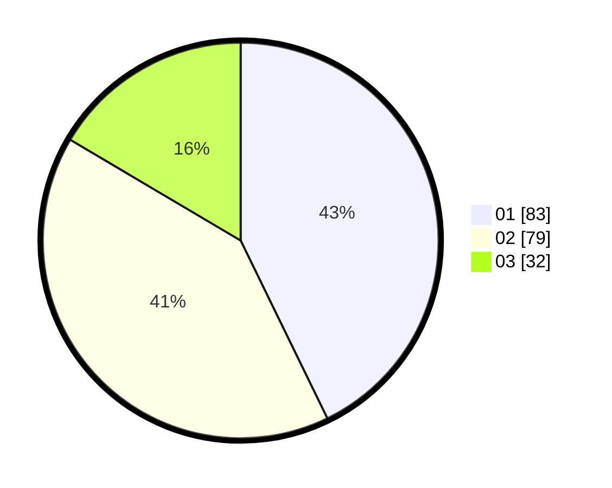

# Hasil

Hasil perolehan suara paslon dapat dilihat pada file paslon-01.txt, paslon-02.txt, dan paslon-03.txt.

Jika tidak ada, artinya data tersebut belum ada pada SIREKAP.

## Perolehan Suara

 * Paslon 01: **83**.
 * Paslon 02: **79**.
 * Paslon 03: **32**.

## Foto C Plano

https://sirekap-obj-formc.kpu.go.id/89fa/pemilu/ppwp/31/74/09/10/01/3174091001091-20240214-155505--1d701bb7-c33d-4689-a603-4828475c327b.jpg

https://sirekap-obj-formc.kpu.go.id/89fa/pemilu/ppwp/31/74/09/10/01/3174091001091-20240214-155521--1259045b-877b-4a94-a4f9-227d70f87424.jpg

https://sirekap-obj-formc.kpu.go.id/89fa/pemilu/ppwp/31/74/09/10/01/3174091001091-20240214-155535--6efdaabf-0061-4d70-a6c9-0d4fd9e7f4ba.jpg

## DATA PEMILIH TETAP

Jumlah pemilih dalam DPT: **235**.
 * L: **124**.
 * P: **111**.

## DATA PENGGUNA HAK PILIH

Jumlah pengguna hak pilih dalam DPT: **195**.
 * L: **98**.
 * P: **97**.

Jumlah pengguna hak pilih dalam DPTb: **2**.
 * L: **0**.
 * P: **2**.

Jumlah pengguna hak pilih dalam DPK: **1**.
 * L: **1**.
 * P: **0**.

Jumlah pengguna hak pilih: **198**.
 * L: **99**.
 * P: **99**.

## JUMLAH SUARA SAH DAN TIDAK SAH

JUMLAH SELURUH SUARA SAH: **194**.

JUMLAH SUARA TIDAK SAH: **4**.

JUMLAH SELURUH SUARA SAH DAN SUARA TIDAK SAH: **198**.
