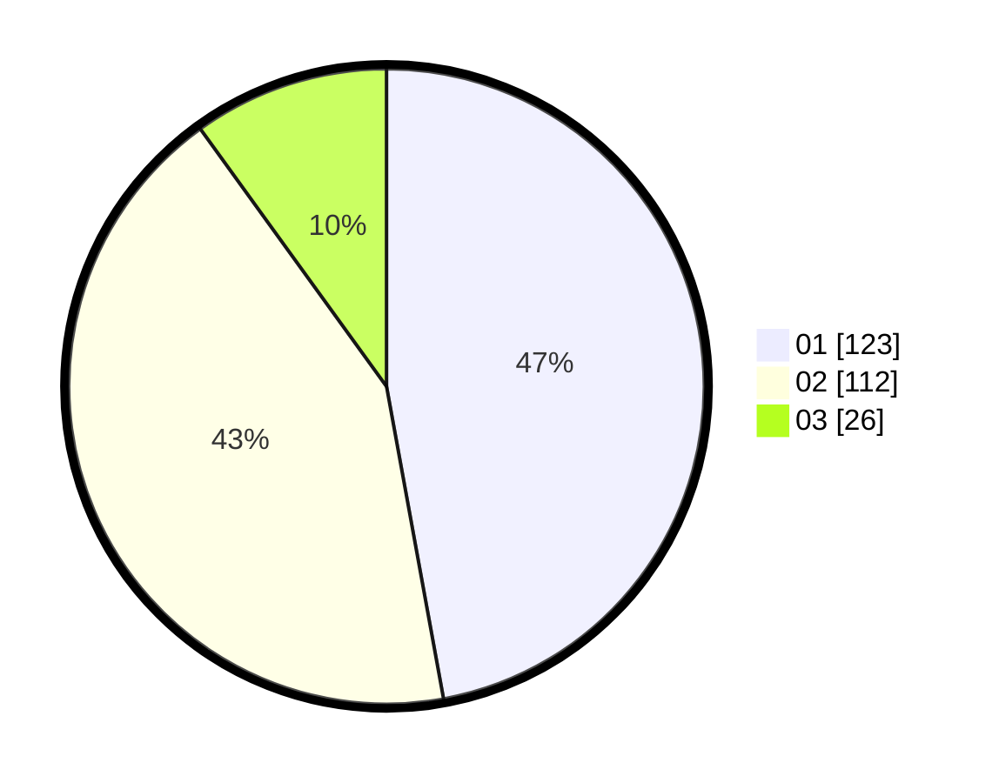

# Hasil

Hasil perolehan suara paslon dapat dilihat pada file paslon-01.txt, paslon-02.txt, dan paslon-03.txt.

Jika tidak ada, artinya data tersebut belum ada pada SIREKAP.

## Perolehan Suara

 * Paslon 01: **123**.
 * Paslon 02: **112**.
 * Paslon 03: **26**.

## Foto C Plano

https://sirekap-obj-formc.kpu.go.id/3d84/pemilu/ppwp/31/74/09/10/01/3174091001108-20240214-210336--935e87fe-b74e-4b94-b536-504ce8b12f55.jpg

https://sirekap-obj-formc.kpu.go.id/3d84/pemilu/ppwp/31/74/09/10/01/3174091001108-20240214-202243--a06217b0-19fd-4cde-a7cc-24390619a50f.jpg

https://sirekap-obj-formc.kpu.go.id/3d84/pemilu/ppwp/31/74/09/10/01/3174091001108-20240214-202247--198b7b8c-2421-41fd-bf89-d449cac15817.jpg

## DATA PEMILIH TETAP

Jumlah pemilih dalam DPT: **300**.
 * L: **157**.
 * P: **143**.

## DATA PENGGUNA HAK PILIH

Jumlah pengguna hak pilih dalam DPT: **255**.
 * L: **129**.
 * P: **126**.

Jumlah pengguna hak pilih dalam DPTb: **8**.
 * L: **3**.
 * P: **5**.

Jumlah pengguna hak pilih dalam DPK: **1**.
 * L: **0**.
 * P: **1**.

Jumlah pengguna hak pilih: **264**.
 * L: **132**.
 * P: **132**.

## JUMLAH SUARA SAH DAN TIDAK SAH

JUMLAH SELURUH SUARA SAH: **261**.

JUMLAH SUARA TIDAK SAH: **3**.

JUMLAH SELURUH SUARA SAH DAN SUARA TIDAK SAH: **264**.
