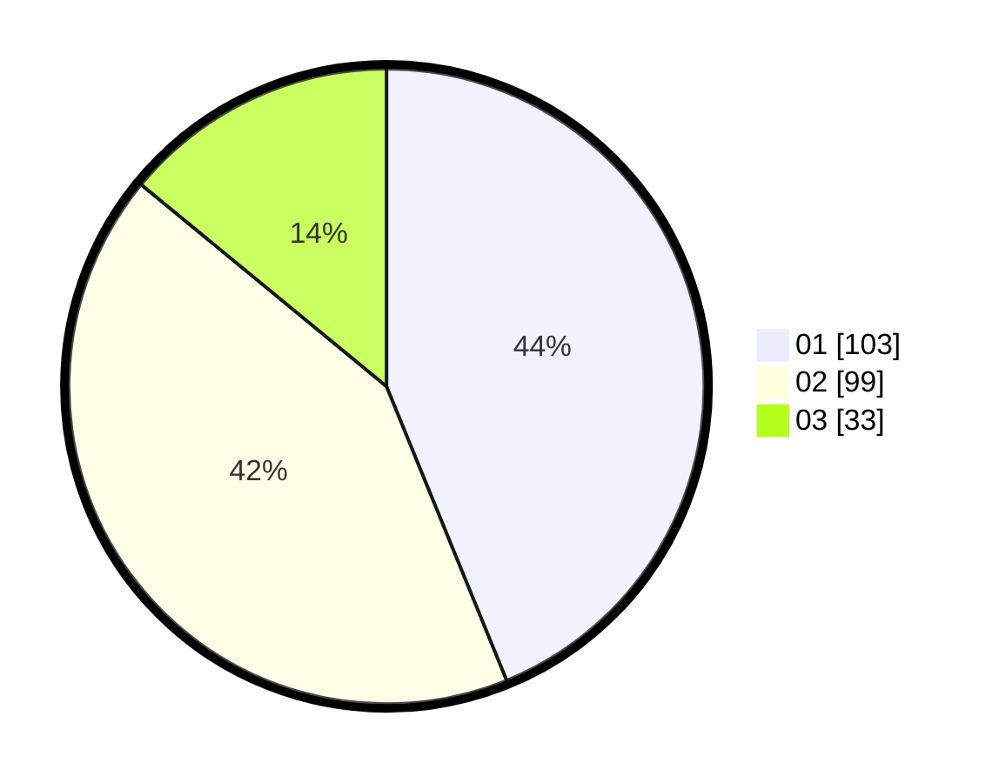

# Hasil

Hasil perolehan suara paslon dapat dilihat pada file paslon-01.txt, paslon-02.txt, dan paslon-03.txt.

Jika tidak ada, artinya data tersebut belum ada pada SIREKAP.

## Perolehan Suara

 * Paslon 01: **103**.
 * Paslon 02: **99**.
 * Paslon 03: **33**.

## Foto C Plano

https://sirekap-obj-formc.kpu.go.id/e5b6/pemilu/ppwp/31/74/09/10/01/3174091001114-20240214-155850--b767beda-c2c5-4a35-9fb7-f08b1a68cd46.jpg

https://sirekap-obj-formc.kpu.go.id/e5b6/pemilu/ppwp/31/74/09/10/01/3174091001114-20240214-160152--b60dcfaf-5cde-4d8c-adf0-df463ba2cc5f.jpg

https://sirekap-obj-formc.kpu.go.id/e5b6/pemilu/ppwp/31/74/09/10/01/3174091001114-20240214-190108--f0c0591e-ebb4-4698-8586-77ca83c513d9.jpg

## DATA PEMILIH TETAP

Jumlah pemilih dalam DPT: **288**.
 * L: **135**.
 * P: **153**.

## DATA PENGGUNA HAK PILIH

Jumlah pengguna hak pilih dalam DPT: **235**.
 * L: **105**.
 * P: **130**.

Jumlah pengguna hak pilih dalam DPTb: **3**.
 * L: **1**.
 * P: **2**.

Jumlah pengguna hak pilih dalam DPK: **2**.
 * L: **1**.
 * P: **1**.

Jumlah pengguna hak pilih: **240**.
 * L: **107**.
 * P: **133**.

## JUMLAH SUARA SAH DAN TIDAK SAH

JUMLAH SELURUH SUARA SAH: **235**.

JUMLAH SUARA TIDAK SAH: **5**.

JUMLAH SELURUH SUARA SAH DAN SUARA TIDAK SAH: **240**.
