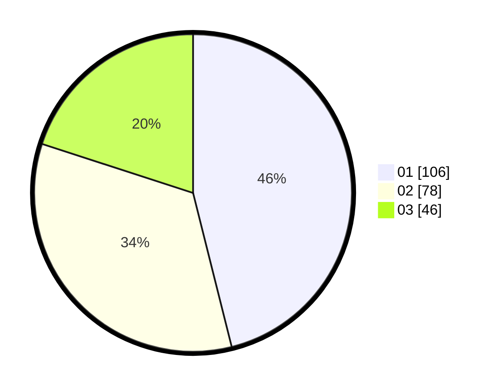

# Hasil

Hasil perolehan suara paslon dapat dilihat pada file paslon-01.txt, paslon-02.txt, dan paslon-03.txt.

Jika tidak ada, artinya data tersebut belum ada pada SIREKAP.

## Perolehan Suara

 * Paslon 01: **106**.
 * Paslon 02: **78**.
 * Paslon 03: **46**.

## Foto C Plano

https://sirekap-obj-formc.kpu.go.id/ccf1/pemilu/ppwp/31/74/09/10/01/3174091001131-20240214-190501--bb473511-d723-4684-9dfd-3585e3b2c71d.jpg

https://sirekap-obj-formc.kpu.go.id/ccf1/pemilu/ppwp/31/74/09/10/01/3174091001131-20240214-190503--4ed5cec1-741f-495b-91e8-f28753fba594.jpg

https://sirekap-obj-formc.kpu.go.id/ccf1/pemilu/ppwp/31/74/09/10/01/3174091001131-20240214-190506--3f778266-6be0-4228-bc5f-1db5af2e6805.jpg

## DATA PEMILIH TETAP

Jumlah pemilih dalam DPT: **280**.
 * L: **145**.
 * P: **135**.

## DATA PENGGUNA HAK PILIH

Jumlah pengguna hak pilih dalam DPT: **228**.
 * L: **117**.
 * P: **111**.

Jumlah pengguna hak pilih dalam DPTb: **4**.
 * L: **2**.
 * P: **2**.

Jumlah pengguna hak pilih dalam DPK: **2**.
 * L: **1**.
 * P: **1**.

Jumlah pengguna hak pilih: **234**.
 * L: **120**.
 * P: **114**.

## JUMLAH SUARA SAH DAN TIDAK SAH

JUMLAH SELURUH SUARA SAH: **230**.

JUMLAH SUARA TIDAK SAH: **4**.

JUMLAH SELURUH SUARA SAH DAN SUARA TIDAK SAH: **234**.
