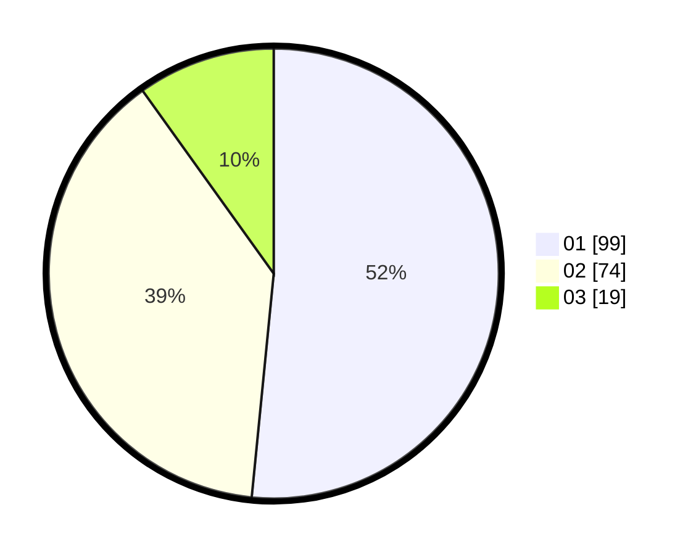

# Hasil

Hasil perolehan suara paslon dapat dilihat pada file paslon-01.txt, paslon-02.txt, dan paslon-03.txt.

Jika tidak ada, artinya data tersebut belum ada pada SIREKAP.

## Perolehan Suara

 * Paslon 01: **99**.
 * Paslon 02: **74**.
 * Paslon 03: **19**.

## Foto C Plano

https://sirekap-obj-formc.kpu.go.id/5fb7/pemilu/ppwp/31/74/09/10/01/3174091001137-20240214-194526--7076d856-988f-48fd-b82e-57291c86faac.jpg

https://sirekap-obj-formc.kpu.go.id/5fb7/pemilu/ppwp/31/74/09/10/01/3174091001137-20240214-191918--1ced17c7-2cf7-4020-8f8e-d80222da3491.jpg

https://sirekap-obj-formc.kpu.go.id/5fb7/pemilu/ppwp/31/74/09/10/01/3174091001137-20240214-200823--94c22047-95c9-444e-866e-9df182e4f71d.jpg

## DATA PEMILIH TETAP

Jumlah pemilih dalam DPT: **249**.
 * L: **116**.
 * P: **133**.

## DATA PENGGUNA HAK PILIH

Jumlah pengguna hak pilih dalam DPT: **185**.
 * L: **84**.
 * P: **101**.

Jumlah pengguna hak pilih dalam DPTb: **3**.
 * L: **0**.
 * P: **3**.

Jumlah pengguna hak pilih dalam DPK: **5**.
 * L: **2**.
 * P: **3**.

Jumlah pengguna hak pilih: **193**.
 * L: **86**.
 * P: **107**.

## JUMLAH SUARA SAH DAN TIDAK SAH

JUMLAH SELURUH SUARA SAH: **140**.

JUMLAH SUARA TIDAK SAH: **1**.

JUMLAH SELURUH SUARA SAH DAN SUARA TIDAK SAH: **193**.
