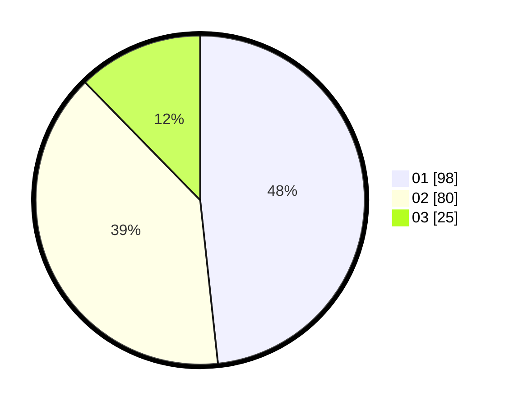

# Hasil

Hasil perolehan suara paslon dapat dilihat pada file paslon-01.txt, paslon-02.txt, dan paslon-03.txt.

Jika tidak ada, artinya data tersebut belum ada pada SIREKAP.

## Perolehan Suara

 * Paslon 01: **98**.
 * Paslon 02: **80**.
 * Paslon 03: **25**.

## Foto C Plano

https://sirekap-obj-formc.kpu.go.id/a211/pemilu/ppwp/31/74/09/10/01/3174091001139-20240214-224024--f57fdd1e-b1aa-48aa-90d1-0f89dee4c3a6.jpg

https://sirekap-obj-formc.kpu.go.id/a211/pemilu/ppwp/31/74/09/10/01/3174091001139-20240214-195136--a1f72d89-f283-4503-9422-201551a71bfb.jpg

https://sirekap-obj-formc.kpu.go.id/a211/pemilu/ppwp/31/74/09/10/01/3174091001139-20240214-195426--d431ab9a-df47-4742-bb3d-073690a1f890.jpg
