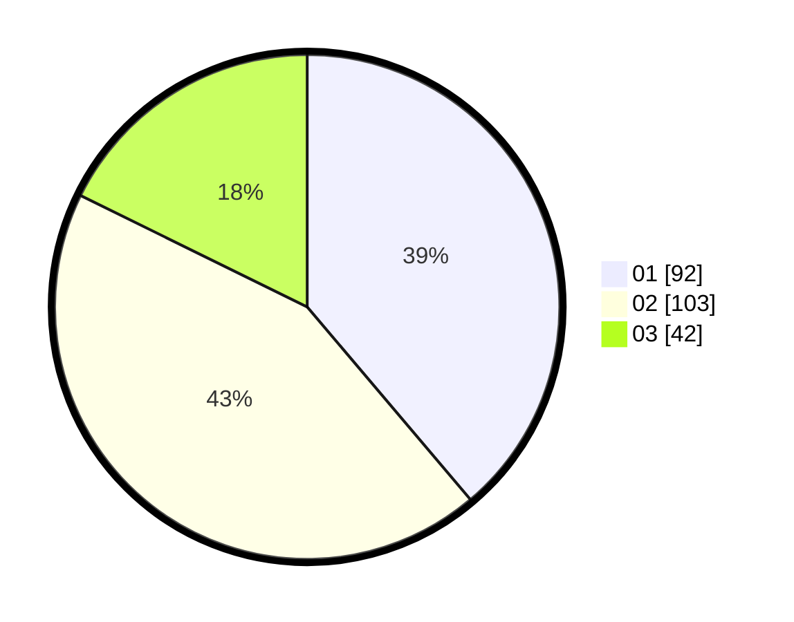

# Hasil

Hasil perolehan suara paslon dapat dilihat pada file paslon-01.txt, paslon-02.txt, dan paslon-03.txt.

Jika tidak ada, artinya data tersebut belum ada pada SIREKAP.

## Perolehan Suara

 * Paslon 01: **92**.
 * Paslon 02: **103**.
 * Paslon 03: **42**.

## Foto C Plano

https://sirekap-obj-formc.kpu.go.id/a3ae/pemilu/ppwp/31/74/09/10/01/3174091001144-20240216-001239--06b14037-a5a4-40ed-aeed-9dfaf7bc6dd3.jpg

https://sirekap-obj-formc.kpu.go.id/a3ae/pemilu/ppwp/31/74/09/10/01/3174091001144-20240216-001242--9feb53c5-09d8-4191-99e9-0e9ec6b2f6bf.jpg

https://sirekap-obj-formc.kpu.go.id/a3ae/pemilu/ppwp/31/74/09/10/01/3174091001144-20240216-001241--2c47bbd0-3904-40da-8a93-f37a1ef72792.jpg

## DATA PEMILIH TETAP

Jumlah pemilih dalam DPT: **289**.
 * L: **149**.
 * P: **140**.

## DATA PENGGUNA HAK PILIH

Jumlah pengguna hak pilih dalam DPT: **233**.
 * L: **114**.
 * P: **119**.

Jumlah pengguna hak pilih dalam DPTb: **1**.
 * L: **1**.
 * P: **0**.

Jumlah pengguna hak pilih dalam DPK: **5**.
 * L: **2**.
 * P: **3**.

Jumlah pengguna hak pilih: **240**.
 * L: **117**.
 * P: **123**.

## JUMLAH SUARA SAH DAN TIDAK SAH

JUMLAH SELURUH SUARA SAH: **237**.

JUMLAH SUARA TIDAK SAH: **3**.

JUMLAH SELURUH SUARA SAH DAN SUARA TIDAK SAH: **240**.
