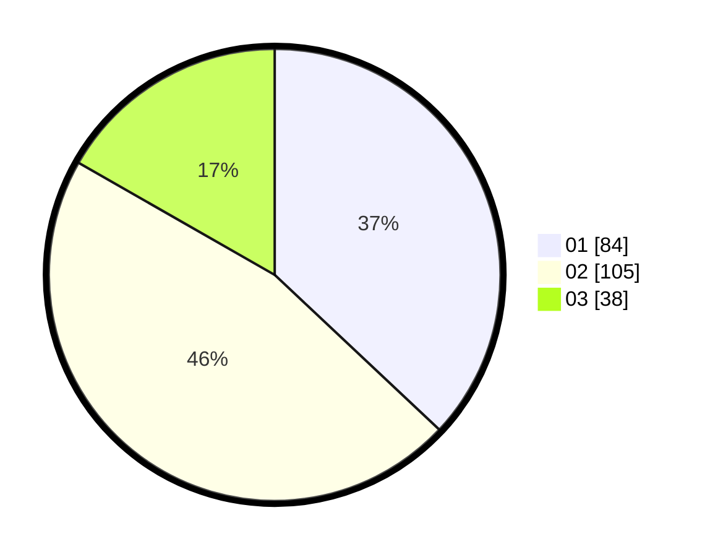

# Hasil

Hasil perolehan suara paslon dapat dilihat pada file paslon-01.txt, paslon-02.txt, dan paslon-03.txt.

Jika tidak ada, artinya data tersebut belum ada pada SIREKAP.

## Perolehan Suara

 * Paslon 01: **84**.
 * Paslon 02: **105**.
 * Paslon 03: **38**.

## Foto C Plano

https://sirekap-obj-formc.kpu.go.id/e511/pemilu/ppwp/31/74/09/10/01/3174091001145-20240216-125534--e31684af-1d3a-475d-8ce3-93a58fb4fbac.jpg

https://sirekap-obj-formc.kpu.go.id/e511/pemilu/ppwp/31/74/09/10/01/3174091001145-20240216-125535--3e57b0e9-cb2e-4762-a523-ab5e9f24bb55.jpg

https://sirekap-obj-formc.kpu.go.id/e511/pemilu/ppwp/31/74/09/10/01/3174091001145-20240214-210907--c00035e7-0bfa-46ea-b7e7-79d3f312a55a.jpg

## DATA PEMILIH TETAP

Jumlah pemilih dalam DPT: **286**.
 * L: **135**.
 * P: **151**.

## DATA PENGGUNA HAK PILIH

Jumlah pengguna hak pilih dalam DPT: **227**.
 * L: **104**.
 * P: **123**.

Jumlah pengguna hak pilih dalam DPTb: **1**.
 * L: **0**.
 * P: **1**.

Jumlah pengguna hak pilih dalam DPK: **2**.
 * L: **1**.
 * P: **1**.

Jumlah pengguna hak pilih: **230**.
 * L: **105**.
 * P: **125**.

## JUMLAH SUARA SAH DAN TIDAK SAH

JUMLAH SELURUH SUARA SAH: **227**.

JUMLAH SUARA TIDAK SAH: **3**.

JUMLAH SELURUH SUARA SAH DAN SUARA TIDAK SAH: **230**.
