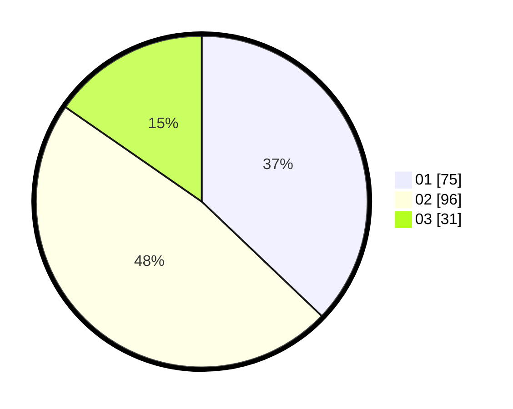

# Hasil

Hasil perolehan suara paslon dapat dilihat pada file paslon-01.txt, paslon-02.txt, dan paslon-03.txt.

Jika tidak ada, artinya data tersebut belum ada pada SIREKAP.

## Perolehan Suara

 * Paslon 01: **75**.
 * Paslon 02: **96**.
 * Paslon 03: **31**.

## Foto C Plano

https://sirekap-obj-formc.kpu.go.id/99dd/pemilu/ppwp/31/74/09/10/01/3174091001153-20240215-213316--77fe8458-9d9d-4794-ae1b-859c747b7d78.jpg

https://sirekap-obj-formc.kpu.go.id/99dd/pemilu/ppwp/31/74/09/10/01/3174091001153-20240215-213318--66f101c2-ff3b-4e0e-99ea-cbff9fa8ae08.jpg

https://sirekap-obj-formc.kpu.go.id/99dd/pemilu/ppwp/31/74/09/10/01/3174091001153-20240215-213317--4e4853a9-7d1b-48d3-afd7-57d76ffdaf3c.jpg

## DATA PEMILIH TETAP

Jumlah pemilih dalam DPT: **245**.
 * L: **128**.
 * P: **117**.

## DATA PENGGUNA HAK PILIH

Jumlah pengguna hak pilih dalam DPT: **204**.
 * L: **105**.
 * P: **99**.

Jumlah pengguna hak pilih dalam DPTb: **0**.
 * L: **0**.
 * P: **0**.

Jumlah pengguna hak pilih dalam DPK: **1**.
 * L: **0**.
 * P: **1**.

Jumlah pengguna hak pilih: **205**.
 * L: **105**.
 * P: **100**.

## JUMLAH SUARA SAH DAN TIDAK SAH

JUMLAH SELURUH SUARA SAH: **202**.

JUMLAH SUARA TIDAK SAH: **3**.

JUMLAH SELURUH SUARA SAH DAN SUARA TIDAK SAH: **205**.
