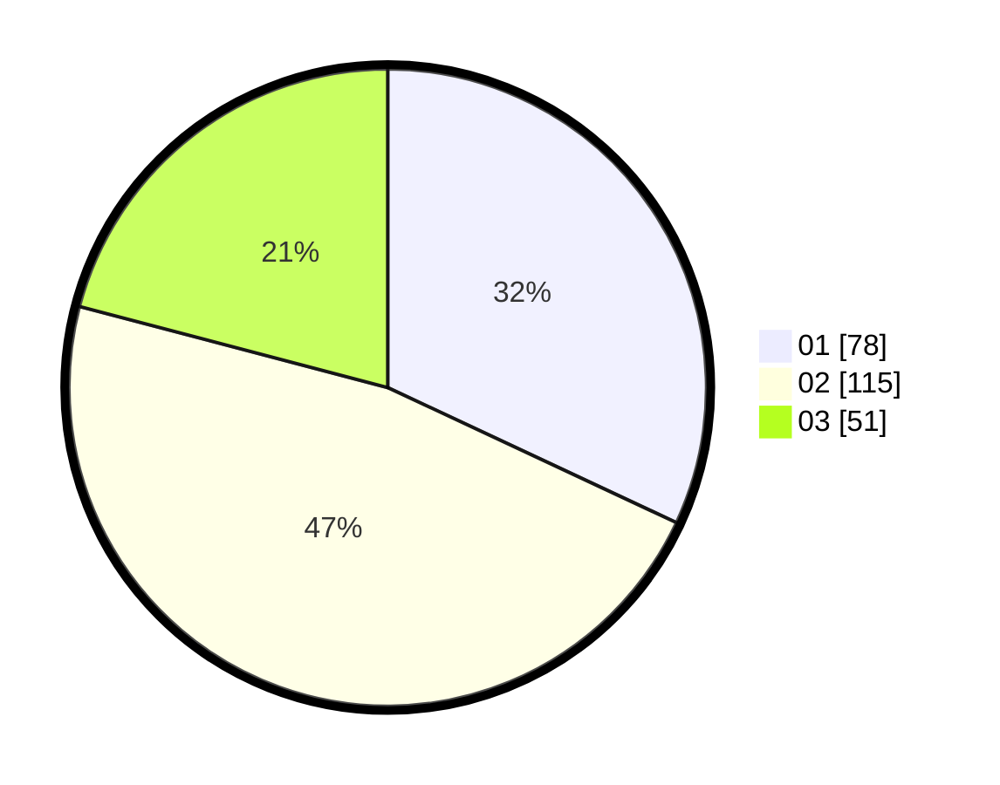

# Hasil

Hasil perolehan suara paslon dapat dilihat pada file paslon-01.txt, paslon-02.txt, dan paslon-03.txt.

Jika tidak ada, artinya data tersebut belum ada pada SIREKAP.

## Perolehan Suara

 * Paslon 01: **78**.
 * Paslon 02: **115**.
 * Paslon 03: **51**.

## Foto C Plano

https://sirekap-obj-formc.kpu.go.id/11a6/pemilu/ppwp/31/74/09/10/01/3174091001154-20240214-210947--b6db81f3-825a-4f58-86f4-27f6674e62e3.jpg

https://sirekap-obj-formc.kpu.go.id/11a6/pemilu/ppwp/31/74/09/10/01/3174091001154-20240214-221309--b0382d3d-c17a-4d2f-8917-1c1744ec44eb.jpg

https://sirekap-obj-formc.kpu.go.id/11a6/pemilu/ppwp/31/74/09/10/01/3174091001154-20240214-211237--a2fb85a2-2e76-43fb-9445-ccfe4c57555d.jpg
