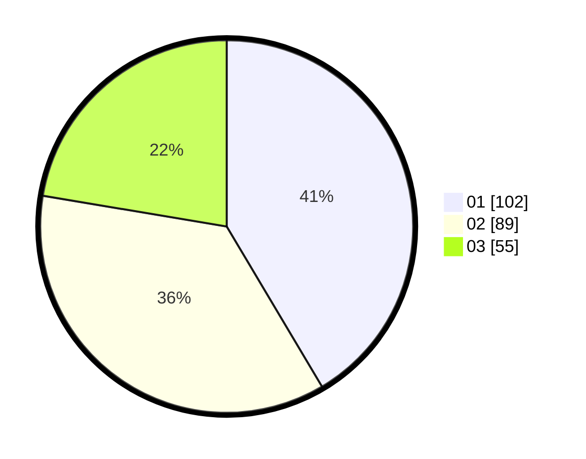

# Hasil

Hasil perolehan suara paslon dapat dilihat pada file paslon-01.txt, paslon-02.txt, dan paslon-03.txt.

Jika tidak ada, artinya data tersebut belum ada pada SIREKAP.

## Perolehan Suara

 * Paslon 01: **102**.
 * Paslon 02: **89**.
 * Paslon 03: **55**.

## Foto C Plano

https://sirekap-obj-formc.kpu.go.id/fb0e/pemilu/ppwp/31/74/09/10/01/3174091001161-20240214-190947--5792e7b2-903c-46f3-99b6-4a2ab1f74518.jpg

https://sirekap-obj-formc.kpu.go.id/fb0e/pemilu/ppwp/31/74/09/10/01/3174091001161-20240214-193042--897bb28a-f8f8-48fd-9af9-c5f343c80518.jpg

https://sirekap-obj-formc.kpu.go.id/fb0e/pemilu/ppwp/31/74/09/10/01/3174091001161-20240214-193745--a36a9ac9-fa05-45a6-b0be-1402cc7fae2c.jpg

## DATA PEMILIH TETAP

Jumlah pemilih dalam DPT: **279**.
 * L: **139**.
 * P: **140**.

## DATA PENGGUNA HAK PILIH

Jumlah pengguna hak pilih dalam DPT: **237**.
 * L: **113**.
 * P: **124**.

Jumlah pengguna hak pilih dalam DPTb: **9**.
 * L: **3**.
 * P: **6**.

Jumlah pengguna hak pilih dalam DPK: **3**.
 * L: **1**.
 * P: **2**.

Jumlah pengguna hak pilih: **249**.
 * L: **117**.
 * P: **132**.

## JUMLAH SUARA SAH DAN TIDAK SAH

JUMLAH SELURUH SUARA SAH: **246**.

JUMLAH SUARA TIDAK SAH: **3**.

JUMLAH SELURUH SUARA SAH DAN SUARA TIDAK SAH: **249**.
