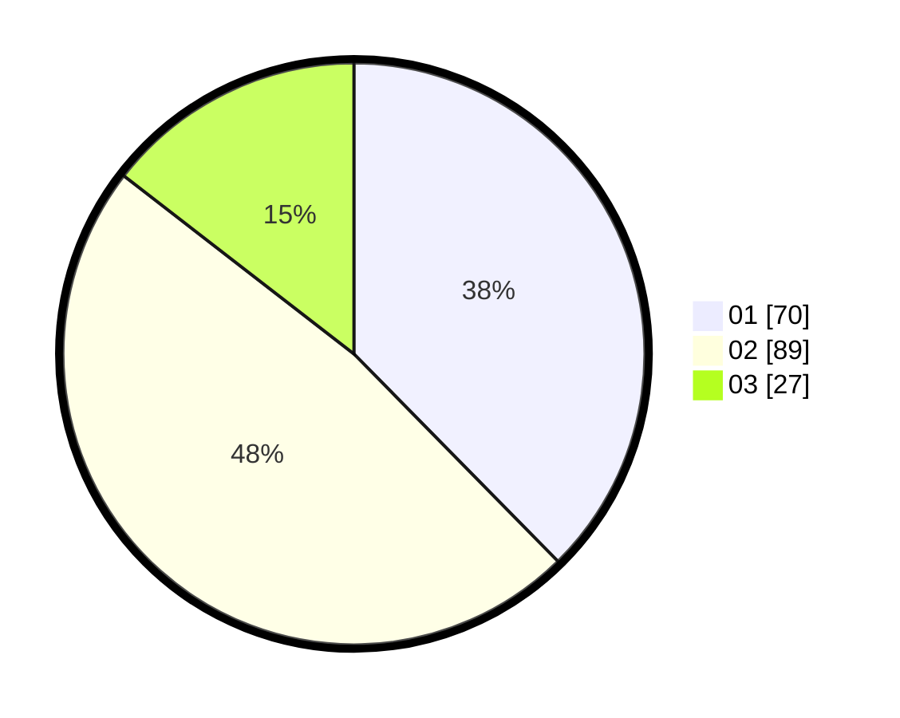

# Hasil

Hasil perolehan suara paslon dapat dilihat pada file paslon-01.txt, paslon-02.txt, dan paslon-03.txt.

Jika tidak ada, artinya data tersebut belum ada pada SIREKAP.

## Perolehan Suara

 * Paslon 01: **70**.
 * Paslon 02: **89**.
 * Paslon 03: **27**.

## Foto C Plano

https://sirekap-obj-formc.kpu.go.id/320d/pemilu/ppwp/31/74/09/10/01/3174091001169-20240215-003729--d1060998-c9fd-4adc-be82-f9ff51ee564e.jpg

https://sirekap-obj-formc.kpu.go.id/320d/pemilu/ppwp/31/74/09/10/01/3174091001169-20240214-155902--7a6f0e96-f9c5-48a7-abd5-dec02ac4b65a.jpg

https://sirekap-obj-formc.kpu.go.id/320d/pemilu/ppwp/31/74/09/10/01/3174091001169-20240215-004056--d3ce12a9-2a40-4595-a384-624bcbceb9ff.jpg

## DATA PEMILIH TETAP

Jumlah pemilih dalam DPT: **255**.
 * L: **124**.
 * P: **131**.

## DATA PENGGUNA HAK PILIH

Jumlah pengguna hak pilih dalam DPT: **186**.
 * L: **88**.
 * P: **98**.

Jumlah pengguna hak pilih dalam DPTb: **1**.
 * L: **0**.
 * P: **1**.

Jumlah pengguna hak pilih dalam DPK: **2**.
 * L: **1**.
 * P: **1**.

Jumlah pengguna hak pilih: **189**.
 * L: **89**.
 * P: **100**.

## JUMLAH SUARA SAH DAN TIDAK SAH

JUMLAH SELURUH SUARA SAH: **186**.

JUMLAH SUARA TIDAK SAH: **3**.

JUMLAH SELURUH SUARA SAH DAN SUARA TIDAK SAH: **189**.
