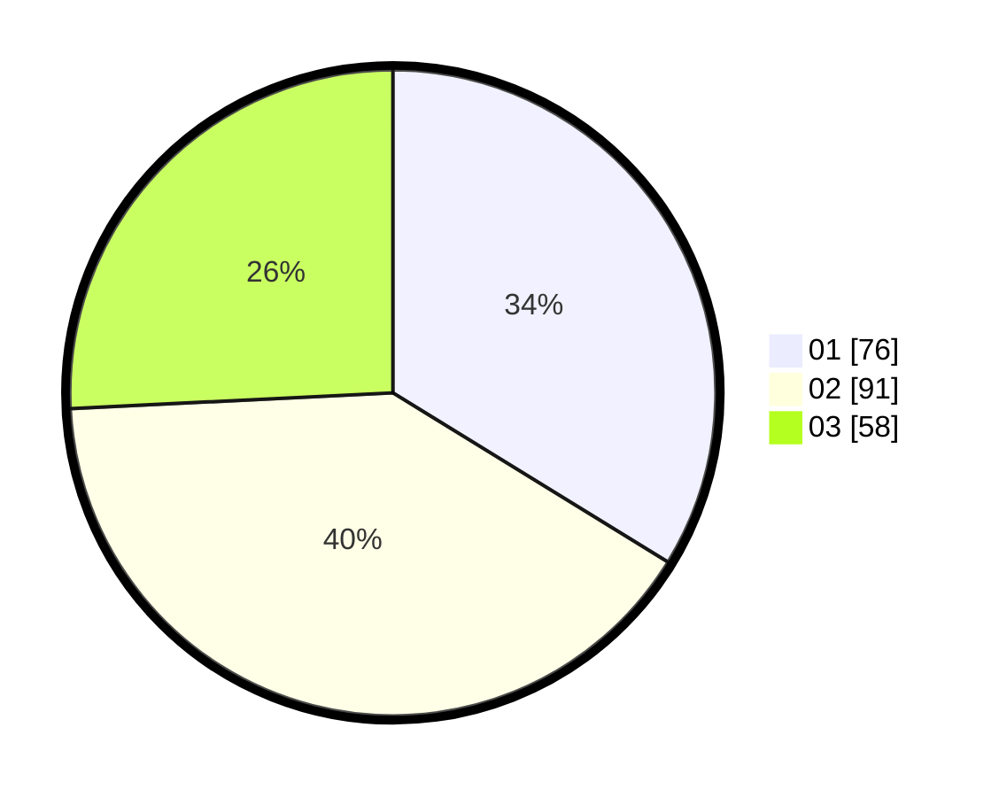

# Hasil

Hasil perolehan suara paslon dapat dilihat pada file paslon-01.txt, paslon-02.txt, dan paslon-03.txt.

Jika tidak ada, artinya data tersebut belum ada pada SIREKAP.

## Perolehan Suara

 * Paslon 01: **76**.
 * Paslon 02: **91**.
 * Paslon 03: **58**.

## Foto C Plano

https://sirekap-obj-formc.kpu.go.id/cb90/pemilu/ppwp/31/74/09/10/01/3174091001172-20240216-010856--86f47013-2e03-49f9-9d24-b85afb4ab40c.jpg

https://sirekap-obj-formc.kpu.go.id/cb90/pemilu/ppwp/31/74/09/10/01/3174091001172-20240216-010900--cc960900-b92d-404f-b871-0a35f7c827b4.jpg

https://sirekap-obj-formc.kpu.go.id/cb90/pemilu/ppwp/31/74/09/10/01/3174091001172-20240216-002854--8a304d77-fe3c-4f46-adce-63c9746dc12b.jpg

## DATA PEMILIH TETAP

Jumlah pemilih dalam DPT: **268**.
 * L: **128**.
 * P: **140**.

## DATA PENGGUNA HAK PILIH

Jumlah pengguna hak pilih dalam DPT: **223**.
 * L: **94**.
 * P: **129**.

Jumlah pengguna hak pilih dalam DPTb: **5**.
 * L: **2**.
 * P: **3**.

Jumlah pengguna hak pilih dalam DPK: **1**.
 * L: **1**.
 * P: **0**.

Jumlah pengguna hak pilih: **229**.
 * L: **97**.
 * P: **132**.

## JUMLAH SUARA SAH DAN TIDAK SAH

JUMLAH SELURUH SUARA SAH: **225**.

JUMLAH SUARA TIDAK SAH: **4**.

JUMLAH SELURUH SUARA SAH DAN SUARA TIDAK SAH: **229**.
