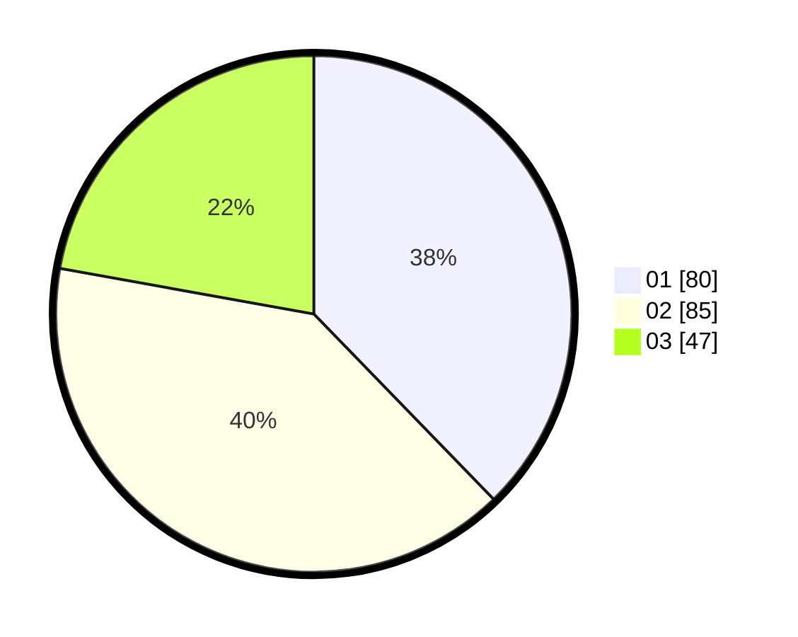

# Hasil

Hasil perolehan suara paslon dapat dilihat pada file paslon-01.txt, paslon-02.txt, dan paslon-03.txt.

Jika tidak ada, artinya data tersebut belum ada pada SIREKAP.

## Perolehan Suara

 * Paslon 01: **80**.
 * Paslon 02: **85**.
 * Paslon 03: **47**.

## Foto C Plano

https://sirekap-obj-formc.kpu.go.id/fd5a/pemilu/ppwp/31/74/09/10/01/3174091001173-20240216-054916--cc105d23-77c4-4e17-88c9-32616fc52649.jpg

https://sirekap-obj-formc.kpu.go.id/fd5a/pemilu/ppwp/31/74/09/10/01/3174091001173-20240216-054920--64d5d7d6-6e45-46a5-934f-fba1383db404.jpg

https://sirekap-obj-formc.kpu.go.id/fd5a/pemilu/ppwp/31/74/09/10/01/3174091001173-20240216-054917--d9e09360-4d7a-4b57-b90d-b7f816ccf01b.jpg

## DATA PEMILIH TETAP

Jumlah pemilih dalam DPT: **273**.
 * L: **135**.
 * P: **138**.

## DATA PENGGUNA HAK PILIH

Jumlah pengguna hak pilih dalam DPT: **215**.
 * L: **106**.
 * P: **109**.

Jumlah pengguna hak pilih dalam DPTb: **0**.
 * L: **0**.
 * P: **0**.

Jumlah pengguna hak pilih dalam DPK: **1**.
 * L: **1**.
 * P: **0**.

Jumlah pengguna hak pilih: **216**.
 * L: **107**.
 * P: **109**.

## JUMLAH SUARA SAH DAN TIDAK SAH

JUMLAH SELURUH SUARA SAH: **212**.

JUMLAH SUARA TIDAK SAH: **4**.

JUMLAH SELURUH SUARA SAH DAN SUARA TIDAK SAH: **216**.
