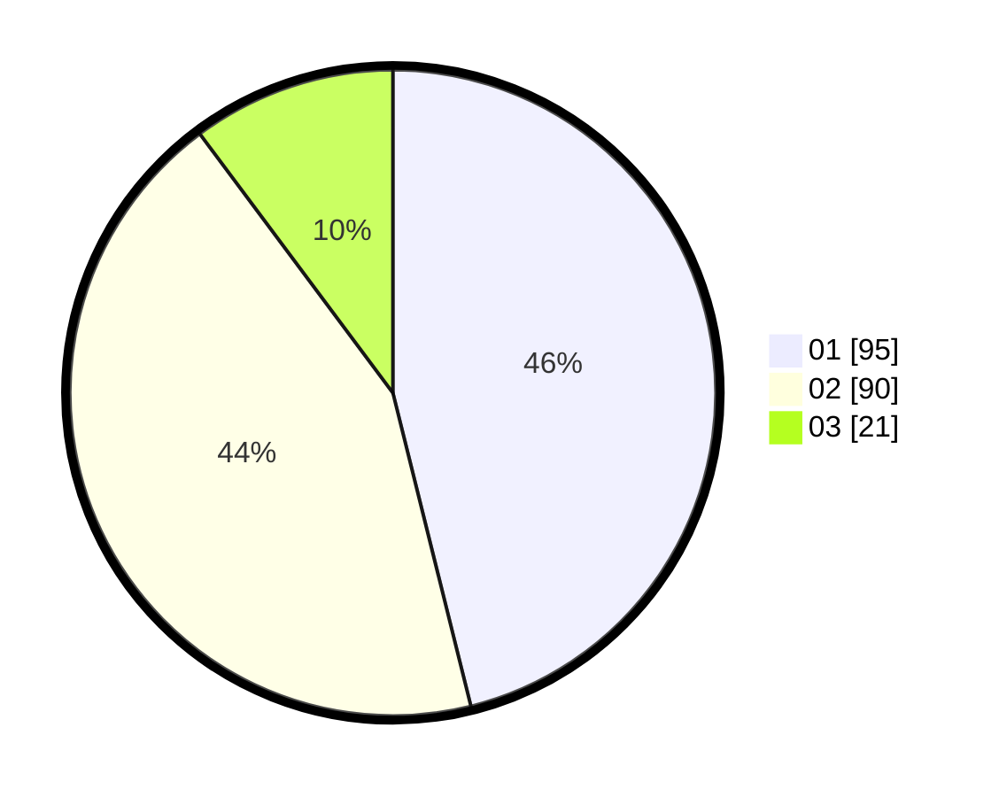

# Hasil

Hasil perolehan suara paslon dapat dilihat pada file paslon-01.txt, paslon-02.txt, dan paslon-03.txt.

Jika tidak ada, artinya data tersebut belum ada pada SIREKAP.

## Perolehan Suara

 * Paslon 01: **95**.
 * Paslon 02: **90**.
 * Paslon 03: **21**.

## Foto C Plano

https://sirekap-obj-formc.kpu.go.id/4efa/pemilu/ppwp/31/74/09/10/01/3174091001174-20240214-204718--090a532f-8e91-4a45-acd9-ab4fe9eb8e8c.jpg

https://sirekap-obj-formc.kpu.go.id/4efa/pemilu/ppwp/31/74/09/10/01/3174091001174-20240214-204938--a8084f3b-e11b-4289-8113-1c4df942680e.jpg

https://sirekap-obj-formc.kpu.go.id/4efa/pemilu/ppwp/31/74/09/10/01/3174091001174-20240214-205344--e05c2169-5a8a-47ea-b554-a7fe694f5e06.jpg

## DATA PEMILIH TETAP

Jumlah pemilih dalam DPT: **253**.
 * L: **131**.
 * P: **122**.

## DATA PENGGUNA HAK PILIH

Jumlah pengguna hak pilih dalam DPT: **207**.
 * L: **105**.
 * P: **102**.

Jumlah pengguna hak pilih dalam DPTb: **0**.
 * L: **0**.
 * P: **0**.

Jumlah pengguna hak pilih dalam DPK: **0**.
 * L: **0**.
 * P: **0**.

Jumlah pengguna hak pilih: **207**.
 * L: **105**.
 * P: **102**.

## JUMLAH SUARA SAH DAN TIDAK SAH

JUMLAH SELURUH SUARA SAH: **206**.

JUMLAH SUARA TIDAK SAH: **1**.

JUMLAH SELURUH SUARA SAH DAN SUARA TIDAK SAH: **207**.
