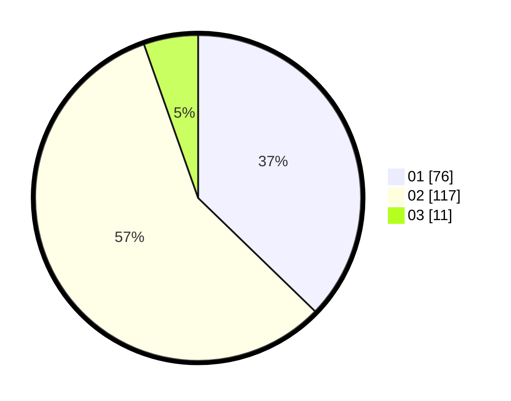

# Hasil

Hasil perolehan suara paslon dapat dilihat pada file paslon-01.txt, paslon-02.txt, dan paslon-03.txt.

Jika tidak ada, artinya data tersebut belum ada pada SIREKAP.

## Perolehan Suara

 * Paslon 01: **76**.
 * Paslon 02: **117**.
 * Paslon 03: **11**.

## Foto C Plano

https://sirekap-obj-formc.kpu.go.id/57a4/pemilu/ppwp/31/74/09/10/01/3174091001181-20240214-194103--acddafff-be01-4578-830a-c9fdab50d6ae.jpg

https://sirekap-obj-formc.kpu.go.id/57a4/pemilu/ppwp/31/74/09/10/01/3174091001181-20240214-194613--9727b93e-0fc6-4f1f-bb02-c0fb6cdf2a5c.jpg

https://sirekap-obj-formc.kpu.go.id/57a4/pemilu/ppwp/31/74/09/10/01/3174091001181-20240214-202251--ffdb3ee7-2522-40aa-b995-02abd9b7aff4.jpg

## DATA PEMILIH TETAP

Jumlah pemilih dalam DPT: **277**.
 * L: **136**.
 * P: **141**.

## DATA PENGGUNA HAK PILIH

Jumlah pengguna hak pilih dalam DPT: **205**.
 * L: **100**.
 * P: **105**.

Jumlah pengguna hak pilih dalam DPTb: **0**.
 * L: **0**.
 * P: **0**.

Jumlah pengguna hak pilih dalam DPK: **0**.
 * L: **0**.
 * P: **0**.

Jumlah pengguna hak pilih: **205**.
 * L: **100**.
 * P: **105**.

## JUMLAH SUARA SAH DAN TIDAK SAH

JUMLAH SELURUH SUARA SAH: **204**.

JUMLAH SUARA TIDAK SAH: **1**.

JUMLAH SELURUH SUARA SAH DAN SUARA TIDAK SAH: **205**.
