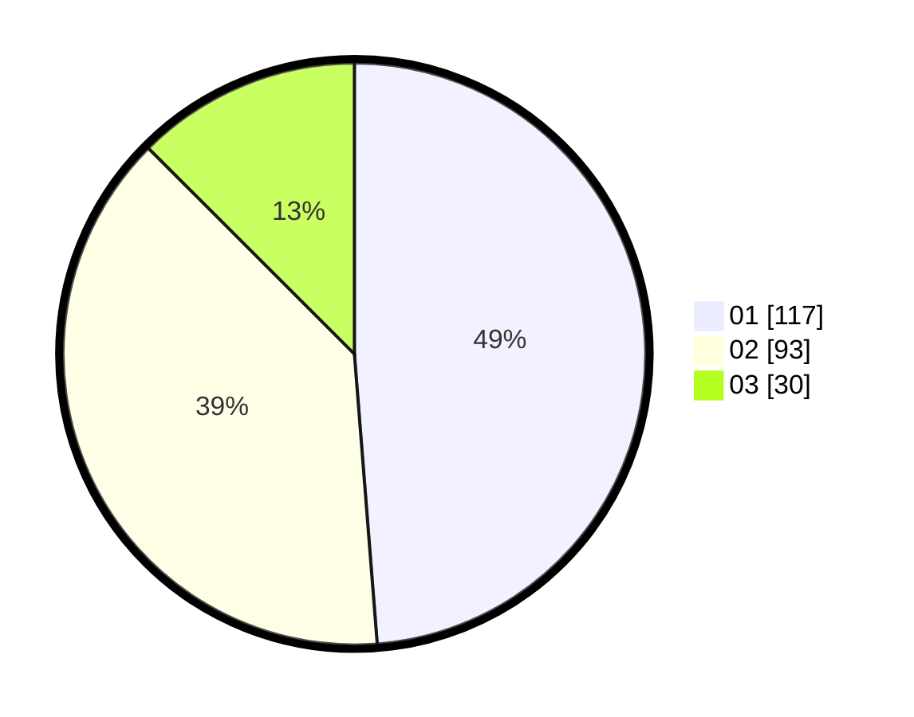

# Hasil

Hasil perolehan suara paslon dapat dilihat pada file paslon-01.txt, paslon-02.txt, dan paslon-03.txt.

Jika tidak ada, artinya data tersebut belum ada pada SIREKAP.

## Perolehan Suara

 * Paslon 01: **117**.
 * Paslon 02: **93**.
 * Paslon 03: **30**.

## Foto C Plano

https://sirekap-obj-formc.kpu.go.id/f1bb/pemilu/ppwp/31/74/09/10/01/3174091001185-20240214-191123--27110c0f-d452-4cfa-9477-fc8772b0ec5f.jpg

https://sirekap-obj-formc.kpu.go.id/f1bb/pemilu/ppwp/31/74/09/10/01/3174091001185-20240214-192615--83def405-fd74-4a79-b09d-b80d32917694.jpg

https://sirekap-obj-formc.kpu.go.id/f1bb/pemilu/ppwp/31/74/09/10/01/3174091001185-20240214-191815--d82de8d9-2e68-4498-8b61-5ad8230a9a94.jpg

## DATA PEMILIH TETAP

Jumlah pemilih dalam DPT: **289**.
 * L: **135**.
 * P: **154**.

## DATA PENGGUNA HAK PILIH

Jumlah pengguna hak pilih dalam DPT: **232**.
 * L: **106**.
 * P: **126**.

Jumlah pengguna hak pilih dalam DPTb: **5**.
 * L: **3**.
 * P: **2**.

Jumlah pengguna hak pilih dalam DPK: **4**.
 * L: **3**.
 * P: **1**.

Jumlah pengguna hak pilih: **241**.
 * L: **112**.
 * P: **129**.

## JUMLAH SUARA SAH DAN TIDAK SAH

JUMLAH SELURUH SUARA SAH: **240**.

JUMLAH SUARA TIDAK SAH: **1**.

JUMLAH SELURUH SUARA SAH DAN SUARA TIDAK SAH: **241**.
