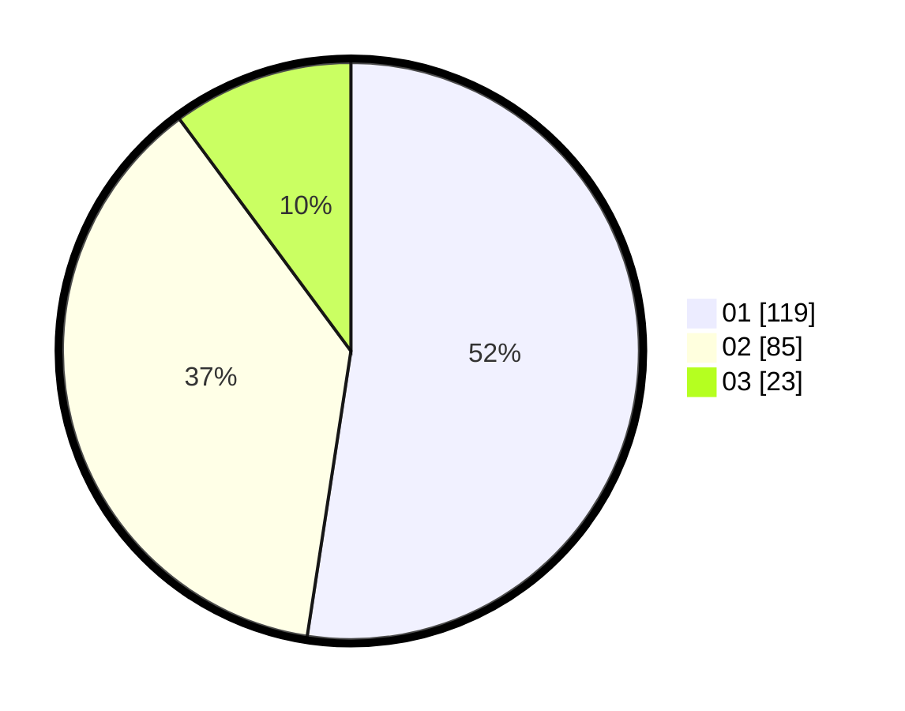

# Hasil

Hasil perolehan suara paslon dapat dilihat pada file paslon-01.txt, paslon-02.txt, dan paslon-03.txt.

Jika tidak ada, artinya data tersebut belum ada pada SIREKAP.

## Perolehan Suara

 * Paslon 01: **119**.
 * Paslon 02: **85**.
 * Paslon 03: **23**.

## Foto C Plano

https://sirekap-obj-formc.kpu.go.id/98f5/pemilu/ppwp/31/74/09/10/01/3174091001195-20240214-220412--80ae9dad-c39b-402f-94ec-634bec1ffb0d.jpg

https://sirekap-obj-formc.kpu.go.id/98f5/pemilu/ppwp/31/74/09/10/01/3174091001195-20240214-221048--6bcf09b8-0a89-4832-b733-760cdc7c370e.jpg

https://sirekap-obj-formc.kpu.go.id/98f5/pemilu/ppwp/31/74/09/10/01/3174091001195-20240214-221151--166c0207-9101-4aa5-b949-07534328b363.jpg

## DATA PEMILIH TETAP

Jumlah pemilih dalam DPT: **261**.
 * L: **122**.
 * P: **139**.

## DATA PENGGUNA HAK PILIH

Jumlah pengguna hak pilih dalam DPT: **233**.
 * L: **106**.
 * P: **127**.

Jumlah pengguna hak pilih dalam DPTb: **0**.
 * L: **0**.
 * P: **0**.

Jumlah pengguna hak pilih dalam DPK: **1**.
 * L: **0**.
 * P: **1**.

Jumlah pengguna hak pilih: **234**.
 * L: **106**.
 * P: **128**.

## JUMLAH SUARA SAH DAN TIDAK SAH

JUMLAH SELURUH SUARA SAH: **227**.

JUMLAH SUARA TIDAK SAH: **7**.

JUMLAH SELURUH SUARA SAH DAN SUARA TIDAK SAH: **234**.
