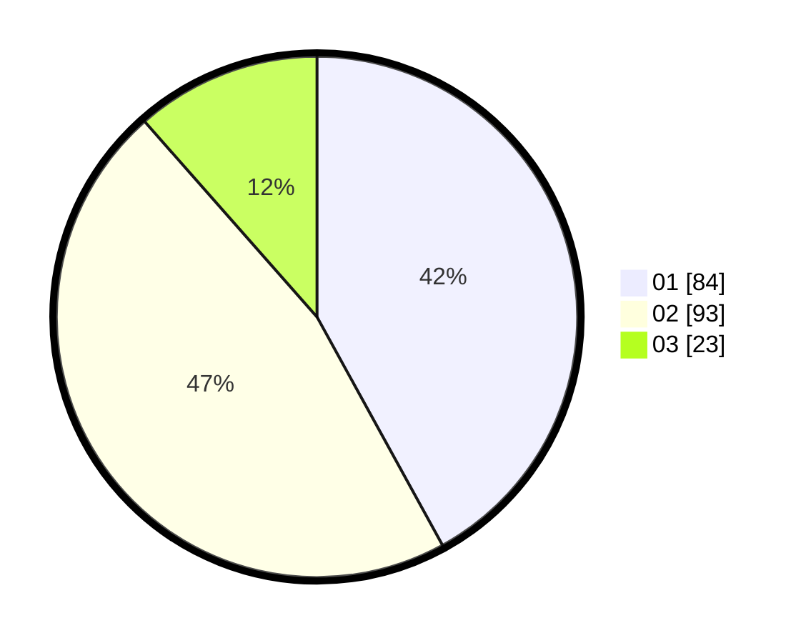

# Hasil

Hasil perolehan suara paslon dapat dilihat pada file paslon-01.txt, paslon-02.txt, dan paslon-03.txt.

Jika tidak ada, artinya data tersebut belum ada pada SIREKAP.

## Perolehan Suara

 * Paslon 01: **84**.
 * Paslon 02: **93**.
 * Paslon 03: **23**.

## Foto C Plano

https://sirekap-obj-formc.kpu.go.id/bc9f/pemilu/ppwp/31/74/09/10/01/3174091001216-20240214-192406--d7d4c9d8-2e5e-4f6b-9811-5b73e62a2395.jpg

https://sirekap-obj-formc.kpu.go.id/bc9f/pemilu/ppwp/31/74/09/10/01/3174091001216-20240214-192420--74a39ad5-a873-49fd-8eae-15007faeb433.jpg

https://sirekap-obj-formc.kpu.go.id/bc9f/pemilu/ppwp/31/74/09/10/01/3174091001216-20240214-192433--33361f84-c402-4646-aacd-6d4fc229cbd9.jpg

## DATA PEMILIH TETAP

Jumlah pemilih dalam DPT: **269**.
 * L: **130**.
 * P: **139**.

## DATA PENGGUNA HAK PILIH

Jumlah pengguna hak pilih dalam DPT: **202**.
 * L: **94**.
 * P: **108**.

Jumlah pengguna hak pilih dalam DPTb: **1**.
 * L: **1**.
 * P: **0**.

Jumlah pengguna hak pilih dalam DPK: **0**.
 * L: **0**.
 * P: **0**.

Jumlah pengguna hak pilih: **203**.
 * L: **95**.
 * P: **108**.

## JUMLAH SUARA SAH DAN TIDAK SAH

JUMLAH SELURUH SUARA SAH: **200**.

JUMLAH SUARA TIDAK SAH: **3**.

JUMLAH SELURUH SUARA SAH DAN SUARA TIDAK SAH: **203**.
