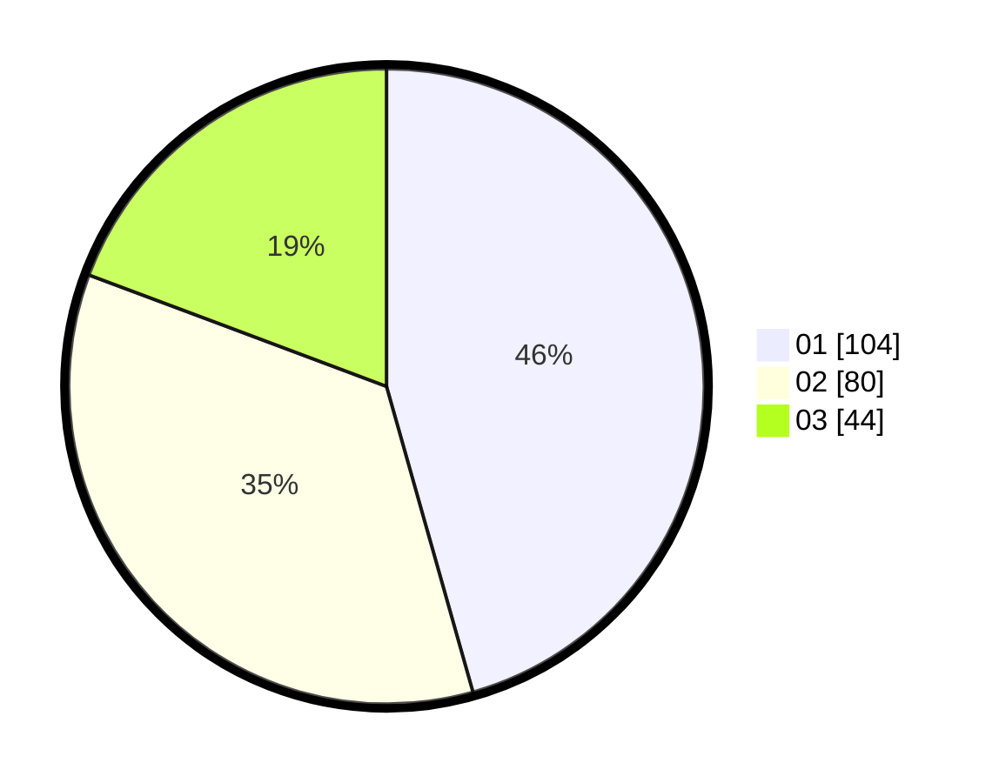

# Hasil

Hasil perolehan suara paslon dapat dilihat pada file paslon-01.txt, paslon-02.txt, dan paslon-03.txt.

Jika tidak ada, artinya data tersebut belum ada pada SIREKAP.

## Perolehan Suara

 * Paslon 01: **104**.
 * Paslon 02: **80**.
 * Paslon 03: **44**.

## Foto C Plano

https://sirekap-obj-formc.kpu.go.id/3f10/pemilu/ppwp/31/74/09/10/01/3174091001218-20240214-192902--ccb90ea2-4ce9-4dc2-b4be-18a818a48c84.jpg

https://sirekap-obj-formc.kpu.go.id/3f10/pemilu/ppwp/31/74/09/10/01/3174091001218-20240214-192434--e8940de5-a451-42ec-8f35-4fc2757028e3.jpg

https://sirekap-obj-formc.kpu.go.id/3f10/pemilu/ppwp/31/74/09/10/01/3174091001218-20240214-193631--48ba3c80-d50a-4a21-8e3d-177697c30f20.jpg

## DATA PEMILIH TETAP

Jumlah pemilih dalam DPT: **279**.
 * L: **139**.
 * P: **140**.

## DATA PENGGUNA HAK PILIH

Jumlah pengguna hak pilih dalam DPT: **224**.
 * L: **107**.
 * P: **117**.

Jumlah pengguna hak pilih dalam DPTb: **2**.
 * L: **1**.
 * P: **1**.

Jumlah pengguna hak pilih dalam DPK: **4**.
 * L: **2**.
 * P: **2**.

Jumlah pengguna hak pilih: **230**.
 * L: **110**.
 * P: **120**.

## JUMLAH SUARA SAH DAN TIDAK SAH

JUMLAH SELURUH SUARA SAH: **228**.

JUMLAH SUARA TIDAK SAH: **2**.

JUMLAH SELURUH SUARA SAH DAN SUARA TIDAK SAH: **230**.
